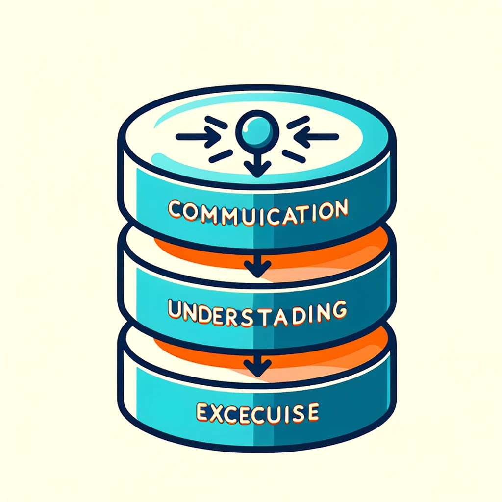
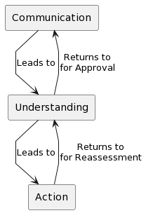
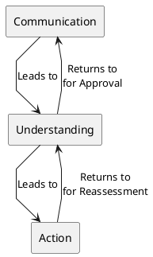
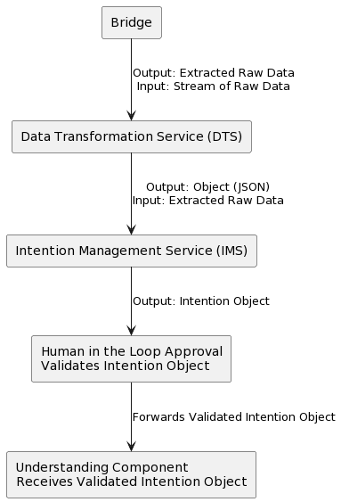
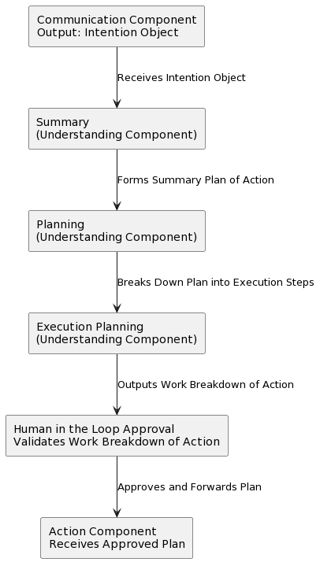
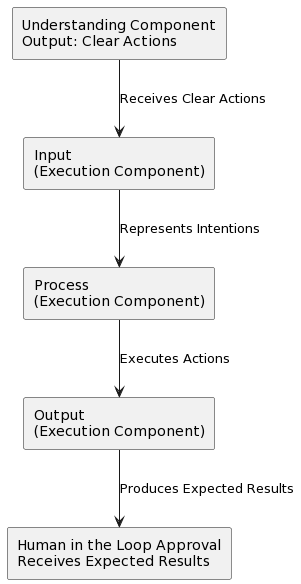
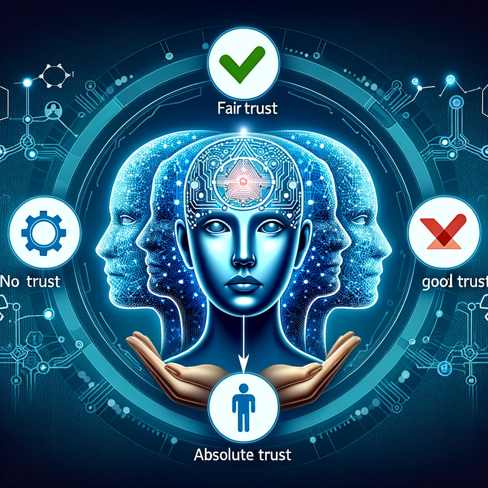

# The Applied Universal Workflow  
*Inspired by the observation of nature*  
  
_by Martin Ouimet_  
_December 2023_  

## Framework Overview

The described framework is a comprehensive system divided into three main components, with each component further broken down into three subcomponents. This structure ensures a meticulous approach to processing, planning, and execution. Below is a summarization of each component and its subcomponents:



### Communication Component
- **Bridge**: Handles the initial processing of raw data streams.
- **Data Transformation Service (DTS)**: Transforms extracted raw data into structured formats (JSON).
- **Intention Management Service (IMS)**: Converts structured data into intention objects for further processing.

### Understanding Component
- **Planning**: Develops strategic plans based on the received intention objects.
- **Execution**: Outlines specific execution steps from the planned strategies.
- **Clearer Action**: Refines the execution plans into clearer, actionable steps.

### Action Component
- **Entering**: Initiates the execution phase by integrating the actionable steps.
- **Input Process Output (IPO)**: Processes the input according to the plan and generates outputs.
- **Confirm**: Confirms and validates the outcomes of the action taken.

### Workflow Interaction
The workflow begins with the Communication component, where raw data is transformed into intention objects. These objects are then passed to the Understanding component, where they are planned and refined into clear actions. These actions are executed in the Action component. Post-execution, there is a reassessment phase that returns to the Understanding component for review. After this review, the outcomes are sent back to the Communication component for final approval, typically involving a "Human in the Loop" validation.

### Diagram
  
The diagram illustrates the cyclical and interconnected nature of these components, emphasizing their sequential and iterative interactions:



This framework provides a structured approach to handling, planning, and executing tasks, with each component playing a vital role in ensuring the effectiveness and efficiency of the overall process. The inclusion of a "Human in the Loop" approval stage further ensures the accuracy and relevancy of each step in the workflow.

## Communication

The "Communication" component processes incoming data through its subcomponents:

- Bridge,
- Data Transformation Service (DTS),
- Intention Management Service (IMS).

These subcomponents handle the data in stages, beginning with raw data processing and ending with the formation of an "Intention Object." The final step involves "Human in the Loop Approval" to review and validate the intention object before it's forwarded to the "Understanding" component.

### Diagram


### UML Code
```uml
@startuml
skinparam linetype polyline

rectangle "Bridge" as B
rectangle "Data Transformation Service (DTS)" as DTS
rectangle "Intention Management Service (IMS)" as IMS
rectangle "Human in the Loop Approval\nValidates Intention Object" as HumanApproval
rectangle "Understanding Component\nReceives Validated Intention Object" as Understanding

B --> DTS : "Output: Extracted Raw Data\nInput: Stream of Raw Data"
DTS --> IMS : "Output: Object (JSON)\nInput: Extracted Raw Data"
IMS --> HumanApproval : "Output: Intention Object"
HumanApproval --> Understanding : "Forwards Validated Intention Object"

@enduml
```

### Explanation:
- The "Bridge" component begins the process by taking a "Stream of Raw Data" and transforming it into "Extracted Raw Data."
- This extracted data is then processed by the "Data Transformation Service (DTS)," which outputs it as an "Object (JSON)."
- The "Intention Management Service (IMS)" takes this JSON object, further processing it to form an "Intention Object."
- Before this intention object is passed on to the "Understanding" component, it undergoes a "Human in the Loop Approval" phase. This phase ensures the intention object is accurate and aligns with desired outcomes.
- Once validated, the intention object is forwarded to the "Understanding" component for further processing.

## Understanding

The "Understanding" component processes the "Intention Object" from the "Communication" component through its subcomponents:

- Summary,
- Planning,
- Execution Planning.

Each of these subcomponents incrementally refines the plan, adding further detail until it's ready to be handed over to the "Action" component. The final step involves "Human in the Loop Approval" to ensure the plan aligns with expected outcomes and objectives.

### Diagram


### UML Code
```uml
@startuml
skinparam linetype polyline

rectangle "Communication Component\nOutput: Intention Object" as Comm
rectangle "Summary\n(Understanding Component)" as Summary
rectangle "Planning\n(Understanding Component)" as Planning
rectangle "Execution Planning\n(Understanding Component)" as ExecPlan
rectangle "Human in the Loop Approval\nValidates Work Breakdown of Action" as HumanApproval
rectangle "Action Component\nReceives Approved Plan" as Action

Comm --> Summary : "Receives Intention Object"
Summary --> Planning : "Forms Summary Plan of Action"
Planning --> ExecPlan : "Breaks Down Plan into Execution Steps"
ExecPlan --> HumanApproval : "Outputs Work Breakdown of Action"
HumanApproval --> Action : "Approves and Forwards Plan"

@enduml
```

### Explanation:
- The "Understanding" component begins with the "Summary" subcomponent, receiving the "Intention Object" from the "Communication" component.
- The "Summary" subcomponent creates a "Summary Plan of Action," subsequently passed to the "Planning" subcomponent.
- The "Planning" stage breaks down this summary plan into a detailed "Plan of Execution."
- The "Execution Planning" subcomponent further refines this plan into a "Work Breakdown of Action."
- Before the plan is handed over to the "Action" component, it goes through the "Human in the Loop Approval" phase, where it is validated and approved, ensuring alignment with the intended goals and objectives.

## Execution
For the "Execution" component, we'll create a PlantUML diagram illustrating its subcomponents and the flow of data through them. This component receives the "Clear Actions" from the "Understanding" component, processes them, and then outputs the expected results.

The subcomponents for the "Execution" component, as described, are:

**Input:** Receives clear actions representing intentions.
**Process:** Executes the actions.
**Output:** Produces the expected results.

### Diagram


#### UML Code
```uml
@startuml
skinparam linetype polyline

rectangle "Understanding Component\nOutput: Clear Actions" as Understanding
rectangle "Input\n(Execution Component)" as Input
rectangle "Process\n(Execution Component)" as Process
rectangle "Output\n(Execution Component)" as Output
rectangle "Human in the Loop Approval\nReceives Expected Results" as HumanApproval

Understanding --> Input : "Receives Clear Actions"
Input --> Process : "Represents Intentions"
Process --> Output : "Executes Actions"
Output --> HumanApproval : "Produces Expected Results"

@enduml
```

### Explanation:
The "Execution" component still starts with "Input," receiving clear actions from the "Understanding" component.
These actions, representing intentions, are processed and executed in the "Process" and "Output" subcomponents, respectively.
The final output is then directed to "Human in the Loop Approval," where the results are reviewed. This step will involve comparing the actual outcome with the expected results, though the detailed process for this comparison and decision-making is not detailed at this stage.

## Ethical Trust Transition in Autonomous Systems

In the evolving landscape of autonomous systems, the concept of "Ethical Trust Transition" emerges as a pivotal framework for navigating the intricate balance between human oversight and machine autonomy. This approach is not just about the technology itself but about fostering a relationship of trust between humans and machines, crucial in an era where decision-making increasingly shifts from human to algorithmic processes.

The essence of Ethical Trust Transition lies in its ability to allow users to configure the level of trust they place in a system, a crucial aspect considering the diverse contexts and ethical implications of automated decision-making. By categorizing trust into distinct levels - ranging from 'No Trust' with continuous human involvement to 'Absolute Trust' with complete system autonomy - it provides a flexible and responsive mechanism that respects individual and societal norms and boundaries.

Why is this necessary? As autonomous systems become more prevalent, from AI-driven data analysis to autonomous vehicles, the question of trust becomes central. How much control should be relinquished to these systems? How can we ensure that their decisions align with our ethical values and expectations? Ethical Trust Transition addresses these questions by offering a structured way to calibrate the level of human oversight based on the reliability, context, and ethical considerations of each system. 

This approach not only enhances the safety and reliability of autonomous systems but also builds user confidence, ensuring that these advanced technologies are utilized in a manner that aligns with human values and ethics. In a world where technology's capabilities and complexities are ever-increasing, Ethical Trust Transition stands as a cornerstone in ensuring that our journey towards greater autonomy is both responsible and aligned with our collective ethical standards.

### Trust Definition
A system with configurable levels of trust, where the user defines their trust towards the system. This trust level determines the extent of autonomy given to the system. Based on your description, there are four levels of trust, each affecting the involvement of human oversight ("Human in the Loop") at different stages of the process:



### 1. No Trust
- **Description**: This is the most cautious trust level.
- **Implementation**: A human is involved in the loop at every stage of each subcomponent. 
- **Implication**: Every action or decision made by the system is confirmed by a human, ensuring maximum oversight but potentially leading to slower processes due to constant human intervention.

### 2. Fair Trust
- **Description**: This level represents a moderate amount of trust in the system.
- **Implementation**: Human oversight occurs at the beginning and the end of each component.
- **Implication**: This allows the system some autonomy in processing within components but retains human control over the initiation and conclusion of each component's activities.

### 3. Good Trust
- **Description**: A higher level of trust is placed in the system's capabilities.
- **Implementation**: Human involvement is only required at the beginning of each component.
- **Implication**: The system operates more autonomously, with humans setting initial parameters or goals and the system managing the internal processes of each component.

### 4. Absolute Trust
- **Description**: This is the highest level of trust, indicating full confidence in the system.
- **Implementation**: The process is streamlined from intention to conclusion without human intervention.
- **Implication**: The system operates entirely autonomously, with no human oversight after initial setup, signifying complete trust in its decision-making and execution abilities.

### Summary
These trust levels allow for flexible integration of human oversight based on the user's comfort and confidence in the system. Lower trust levels ensure thorough human supervision, suitable for sensitive or critical operations. Higher trust levels grant the system more autonomy, suitable for operations where speed and efficiency are prioritized, and the system has proven reliability. This gradation of trust levels provides a customizable approach to balancing human control and automated efficiency, crucial in systems requiring ethical considerations and varying degrees of autonomy.

### Enhanced Plan for Proof of Concept with Emphasis on Purpose and Applicability

#### Purpose and Significance

**Objective Expanded**: The primary goal of this PoC is to demonstrate a streamlined, trust-based system capable of handling complex tasks, such as software development projects (e.g., creating a contact management system), with the potential to extend this workflow model to various fields. The essence of this system lies in its ability to adapt to varying levels of human oversight, ensuring ethical compliance while maintaining efficiency.

#### Why This Matters

- **Streamlining Complex Tasks**: The system is designed to break down and manage complex processes, like software development, into manageable components, automating various stages while keeping human decision-making integral where necessary.
- **Flexibility in Task Management**: It showcases how tasks of different natures, from coding to general project management, can be efficiently handled by adjusting trust levels.
- **Ethical Oversight in Automation**: By incorporating different trust levels, the system ensures that ethical considerations and human judgment are not overridden by automated processes.
- **Scalability and Adaptability**: The framework demonstrates scalability and adaptability, vital for applying this model to various fields beyond software development.

#### Revised Plan of Action with Emphasis on Applicability

1. **System Architecture Tailored for Broad Applicability**: Define the architecture with a focus on modularity, allowing the system to be adapted for different types of tasks, from software development to broader project management.

2. **Development of Components with Real-World Use Cases**: Develop each component (Bridge, DTS, IMS, etc.) not just as isolated entities, but with the potential to handle real-world tasks like generating code bases or managing contact systems.

3. **Customizable Trust Level Integration**: Emphasize the integration of trust levels to showcase how the system adapts to tasks of varying complexity and sensitivity.

4. **HITL Interface for Diverse Applications**: Design the HITL interface to be intuitive and applicable for various types of tasks, ensuring easy adaptation to different industries and sectors.

#### Expected Outcomes with Broader Impact

1. **Versatile PoC**: A proof of concept that not only demonstrates a technical concept but also showcases its potential for various practical applications.

2. **Blueprint for Task Automation**: Provide a blueprint on how complex tasks can be automated while retaining essential human oversight, making it a valuable model for various industries.

3. **Insights into Ethical Automation**: Offer insights into how automated systems can be designed to respect ethical boundaries and adapt to user trust levels.

#### Conclusion with Emphasis on Applicability

The completion of this PoC will mark a significant step towards understanding and implementing flexible, ethical automation in various domains. It aims to bridge the gap between the efficiency of automated systems and the necessity of human judgment, providing a model that is not only technically sound but also ethically responsible and widely applicable. This framework could revolutionize how we approach complex tasks in software development and beyond, paving the way for smarter, more ethical automation solutions in various fields.

## Proof of Concept Small Scale
### Main Components of the System

1. **Communication Component**
   - **Bridge**: Handles the initial ingestion and basic processing of raw data streams.
   - **Data Transformation Service (DTS)**: Transforms the raw data into a more structured format, such as JSON.
   - **Intention Management Service (IMS)**: Interprets the transformed data to generate intention objects for further processing.

2. **Understanding Component**
   - **Summary**: Analyzes the intention objects to create a high-level summary or overview of the required actions or processes.
   - **Planning**: Develops detailed plans or strategies based on the summary provided.
   - **Execution Planning**: Breaks down the plans into executable steps or actions, preparing them for implementation.

3. **Action Component**
   - **Entering**: Initiates the execution phase, taking in the executable steps from the Understanding component.
   - **Input Process Output (IPO)**: Processes the input according to the planned actions and generates outputs as a result.
   - **Confirm**: Involves validation or confirmation of the actions taken, ensuring they align with the intended outcomes.

### Human in the Loop (HITL) Integration

Depending on the trust level set within the system, human oversight (HITL) can be integrated at various stages:

- **No Trust**: Human validation at every subcomponent stage.
- **Fair Trust**: Human oversight at the start and end of each main component.
- **Good Trust**: Human input required only at the start of each main component.
- **Absolute Trust**: Minimal to no human intervention, with the system operating largely autonomously.

### Summary

This system is designed to process and act on data in a structured, step-by-step manner, allowing for varying degrees of automation and human oversight. The structure facilitates the handling of complex tasks by breaking them down into manageable subcomponents, while also integrating ethical considerations through the HITL mechanism. This flexible approach ensures that tasks can be adapted to different levels of complexity and sensitivity, making the system versatile and applicable across various domains.

## PoC Guidelines
### Communication Component

#### 1. Bridge (TypeScript)

**Folder Structure**:
- `bridge/`
  - `index.ts`
  - `Dockerfile`
  - `package.json`

**index.ts (Example)**:
```typescript
import express from 'express';
const app = express();
app.use(express.json());

app.post('/receive-data', (req, res) => {
    // Process and forward data to DTS
    res.json({ status: 'Data forwarded to DTS' });
});

const PORT = 3000;
app.listen(PORT, () => console.log(`Bridge service running on port ${PORT}`));
```

#### 2. Data Transformation Service (DTS)

Similar structure and setup as Bridge, but the logic will be for transforming data.

#### 3. Intention Management Service (IMS)

Handles the interpretation of transformed data and generates intention objects.

### Understanding Component

#### 1. Summary (Python)

**Folder Structure**:
- `summary/`
  - `app.py`
  - `Dockerfile`
  - `requirements.txt`

**app.py (Example)**:
```python
from flask import Flask, request

app = Flask(__name__)

@app.route('/process-summary', methods=['POST'])
def process_summary():
    data = request.json
    # Process data and create summary
    return {"status": "Summary Created"}

if __name__ == "__main__":
    app.run(host='0.0.0.0', port=5001)
```

#### 2. Planning

Similar setup as Summary, focused on planning based on the summary.

#### 3. Execution Planning

Handles the breakdown of plans into executable steps.

### Action Component

#### 1. Entering (Python)

Sets up the execution phase based on plans from the Understanding component.

#### 2. Input Process Output (IPO)

Processes input and executes actions, producing output.

#### 3. Confirm

Handles validation and confirmation of the executed actions.

### Docker Setup

Each component will have a Dockerfile. For TypeScript services:

```Dockerfile
# TypeScript Dockerfile example
FROM node:14
WORKDIR /app
COPY package*.json ./
RUN npm install
COPY . .
EXPOSE 3000
CMD ["node", "index.ts"]
```

For Python services:

```Dockerfile
# Python Dockerfile example
FROM python:3.8
WORKDIR /app
COPY requirements.txt .
RUN pip install -r requirements.txt
COPY . .
CMD ["python", "app.py"]
```

### Docker Compose Configuration

Define a `docker-compose.yml` to link all these services:

```yaml
version: '3'
services:
  bridge:
    build: ./bridge
    ports:
      - "3000:3000"
  summary:
    build: ./summary
    ports:
      - "5001:5001"
  # ... other services
```

### Next Steps for Implementation

1. Create each service's folder and add the provided code.
2. For TypeScript components, initialize with `npm init` and install dependencies (`express`, etc.).
3. For Python components, create `requirements.txt` with `Flask`.
4. Build Docker images and run the system using Docker Compose.

This scaffold provides a foundational structure for your PoC. You'll need to fill in the specific logic for each component based on your project's requirements. Remember, this is a starting point, and the real value will come as you develop and expand upon these basic building blocks.

## What's Next
**Explore iBrain One: Transforming Software Development Through Conversation**

Experience the future of software development with iBrain One – not just a platform, but a conversation partner in your development journey. Dive into a new realm of project creation at [www.ibrain.one](http://www.ibraint.one), where your spoken intentions set the course for innovative software solutions.

**What Sets iBrain One Apart?**

- **Conversational Interactions**: iBrain One goes beyond voice commands or typing. Engage in natural, human-like discussions about your project's goals, needs, and expectations.
- **Intention-Driven Development**: It's not about instructing step by step; it's about sharing your vision and objectives. iBrain One understands and interprets your intentions, translating them into actionable plans and development strategies.
- **Dynamic, Responsive Dialogue**: As you converse with iBrain One, it dynamically responds, asks clarifying questions, and actively participates in the planning and execution process, much like a skilled colleague would.

**Your Invitation to Interact**:

- Visit [www.ibrain.one](http://www.ibrain.one) to start a dialogue with iBrain One.
- Share your project vision, engage in an interactive planning session, and witness how iBrain One brings your intentions to fruition.

iBrain One represents a leap forward in collaborative AI, where the focus is on understanding and executing your intentions, making software development more intuitive, efficient, and aligned with your creative vision.
