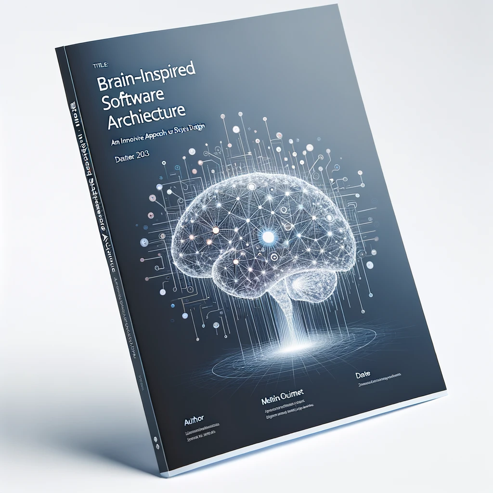
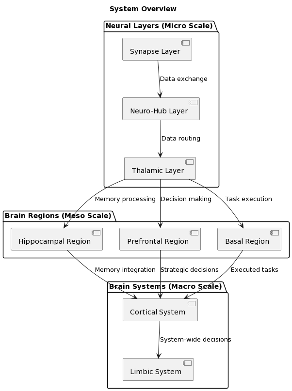
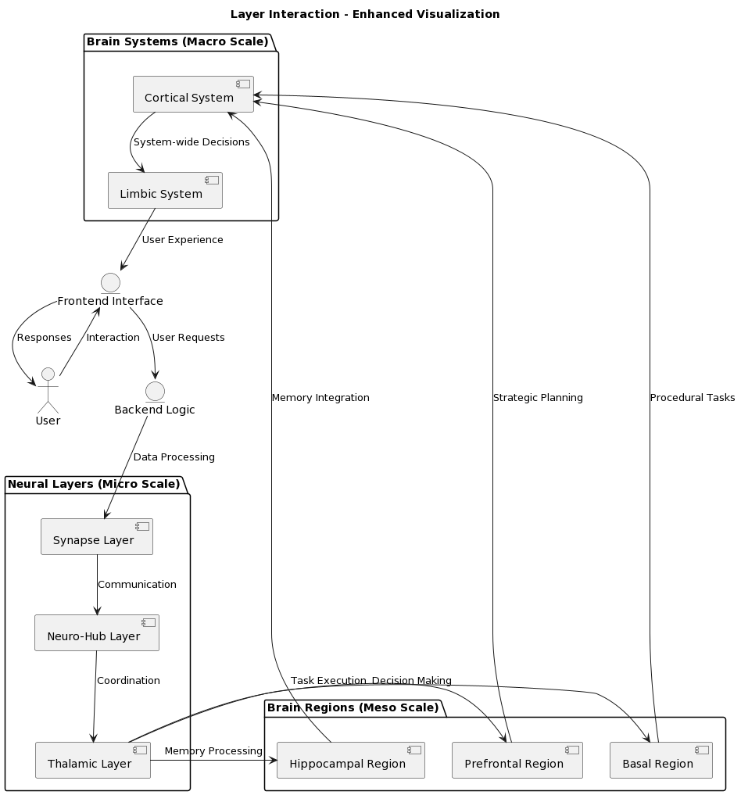
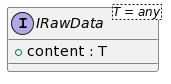
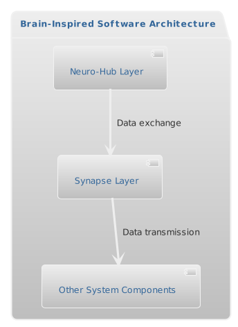
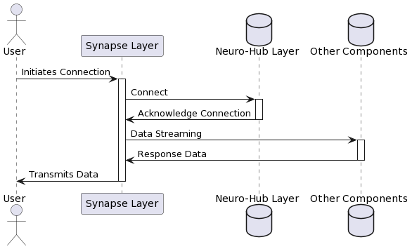
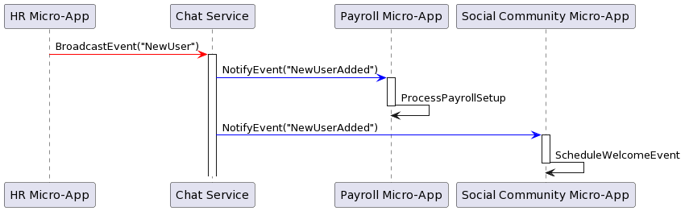
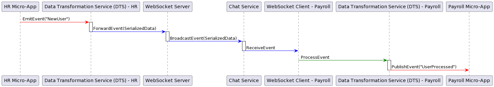
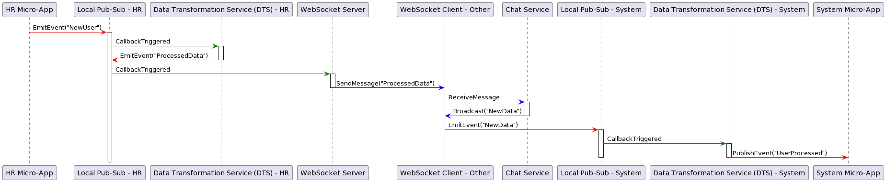

# Brain-Inspired Software Architecture
_By Martin Ouimet_ _mouimet@infinisoft.world_

In the ever-evolving landscape of technology, the "Brain-Inspired Software Architecture" presents an out-of-the-box approach to system design. Authored by Martin Ouimet, this document delves into the intricacies of constructing software systems that mirror the functionalities and structures of the human brain. It introduces a novel architectural framework that encompasses neural layers, brain regions, and integrated systems, aiming to keep simple how we conceptualize and develop software.

## Table of Contents

### Part I: Overview and Framework
1. **Introduction**
   - Overview of Brain-Inspired Software Architecture.
   - Martin Ouimet's journey: A tale of resilience, innovation, and transformation.

2. **Conceptual Framework**
   - Introduction to the Tripartite System Pattern.
   - Description of Neural Layers, Brain Regions, and Brain Systems.

### Part II: Detailed Architecture
3. **Neural Layers (Micro Scale)**
   - Detailed analysis of Neural Layers.
   - Functionality and significance in the architecture.

4. **Brain Regions (Meso Scale)**
   - Exploration of Brain Regions.
   - Roles and responsibilities in the system design.

5. **Brain Systems (Macro Scale)**
   - Understanding Brain Systems.
   - Integration and holistic functioning of the architecture.

6. **Innovative Design Principles**
   - Depth, encapsulation, and the KISS principle.
   - How these principles are applied in the architecture.

7. **Harmonia and Balance: Left and Right Hemispheres**
   - Backend as Left Hemisphere: Logic and Analysis.
   - Frontend as Right Hemisphere: Creativity and Intuition.
   - Integration of both hemispheres in system design.

8. **Implementing the Tripartite System Pattern**
   - Practical application in software development.
   - Case studies and examples.

### Part III: Technical Section
9. **Neural Layers (Micro Scale) - Component Specifications**
   - Synapse Layer, Neuro-Hub Layer, Thalamic Layer.
   - Interaction Overview.

10. **Brain Regions (Meso Scale) - Component Specifications**
    - Hippocampal Region, Prefrontal Region, Basal Region.
    - Interaction Overview.

11. **Brain Systems (Macro Scale) - Component Specifications**
    - Cortical System, Limbic System.
    - Interaction Overview.

### Part IV: Conclusions and Future Directions
12. **Future of Software Engineering**
    - Implications and potential advancements.

13. **Conclusion**
    - Summary and final thoughts.

### Part V: Appendices
14. **Appendices**
    - Additional technical details, data schemas, and documentation.

# Brain-Inspired Software Architecture
_By Martin Ouimet_

## Introduction to Brain-Inspired Software Architecture

The "Brain-Inspired Software Architecture" represents a transformative approach in software design, driven by Martin Ouimet's profound vision and six years of dedicated pursuit. This framework, rooted in Québec, Canada, is more than an architectural concept; it's a narrative of resilience, innovation, and a journey towards a revolutionary perspective in technology.

### A New Paradigm in Software Design
At its core, the "Brain-Inspired Software Architecture" is a groundbreaking adaptation of software architecture to the realms of AI, including large language models (LLMs), natural language understanding (NLU), and the complexities of modern applications. This framework is not just about integrating advanced AI capabilities into software systems; it's about reimagining software design to be intuitively adaptive, deeply aligned with human needs, and inherently simple.

#### Embracing Human-Centric Design
This architecture signifies a shift from the conventional approach where humans adapt to software limitations, to a paradigm where software adapts to human needs. The integration of AI, LLM, and NLU forms the backbone of this architecture, enabling software to understand, learn, and interact in more human-like ways. The simplicity in design and operation ensures that these advanced capabilities don't add to the complexity but rather make technology more accessible and useful for everyone.

#### Vision for a Transformative Future
Martin Ouimet's journey, marked by persistence and ingenuity, reflects a commitment to not just conceptualizing but actualizing a vision where technology serves humanity more seamlessly. This framework is an invitation to explore how AI can be harnessed to create software that is not only functionally superior but also more aligned with human intuition and requirements.

As we delve deeper into the "Brain-Inspired Software Architecture," we uncover how each element of this sophisticated model plays a role in creating a harmonious, intelligent, and user-centric software ecosystem. This introduction sets the stage for a comprehensive exploration of a software architecture that is poised to redefine our interaction with technology.

### Martin Ouimet: A Mosaic of Skills and Perseverance

Martin's journey is characterized by an insatiable quest to understand and define a groundbreaking concept, persisting through more than a thousand setbacks and restarts. Each challenge fueled his determination to chase the essence of his vision, which was not a fleeting idea but a powerful inspiration to use nature's patterns to simplify and solve complex real-world problems.

Educationally, Martin's background spans studies in Software Engineering at École de technologies Supérieure (ÉTS), Finance and Economics at Hautes Études Commerciales (HEC), and a Programmer Analyst qualification from Collège CDI. It is, however, his self-taught expertise and experiences that truly define his professional journey. Martin's skill set covers a broad spectrum, from Artificial Intelligence and Blockchain to Cloud Architecture and UX/UI Design, demonstrating his capability to master diverse technologies.

Beyond his professional endeavors, Martin's story is one of personal transformation and self-discovery. Having overcome past criminal involvements and incarceration, Martin's narrative is one of redemption and profound self-realization. His commitment to teaching and mentoring as, expert in the field internship master, for dozens of undergraduate students, coupled with his unwavering dedication to the Brainstack project, reflect his desire to channel his experiences into positive, impactful ventures.

### The Genesis of Brain-Inspired Software Architecture

The Brainstack project represents the culmination of Martin's pursuit of his eureka moment. Driven by the idea of harnessing nature's patterns to simplify complex problems, this project introduces principles such as scale, encapsulation, and the importance of perspective. These concepts are not just technical abstractions; they embody Martin's belief in aligning technology with natural paradigms to create more human, intuitive, effective, and simple solutions.

Martin's dedication to the Brainstack project is a testament to his unwavering commitment, having worked tirelessly for over six years without a break to bring his vision to life. His approach to the project is a unique blend of technology and philosophy, aiming to achieve a deeper understanding and connection with the world through technological innovation.

### Unveiling the Brain-Inspired Software Architecture

As we delve into the "Brain-Inspired Software Architecture," we uncover a framework that is as technically profound as it is deeply rooted in Martin Ouimet's personal journey and insights. More than a blueprint for software development, this document narrates human endeavor, resilience, and the power of an idea pursued with conviction.

---

## Conceptual Framework

### Introduction to the Tripartite System Pattern

At the heart of the "Brain-Inspired Software Architecture" is the Tripartite System Pattern, a design principle that Martin Ouimet has passionately explored and refined. This pattern is influenced by natural systems and their inherent simplicity, efficiency, and scalability. It is structured into three interconnected segments: micro, meso, and macro, each serving a distinct function yet seamlessly integrated for overall system coherence. Interesting fact, that pattern make sense in diverse fields. Refer to [Tripartite System Pattern In-Depth](https://github.com/repo) detailed informations.

#### Micro Scale: Neural Layers
The Neural Layers represent the micro scale, akin to the neurons in the human brain. This layer focuses on foundational data processing and elemental interactions within the system. It deals with the granular aspects, such as data transmission, initial processing, and basic communication protocols.

#### Meso Scale: Brain Regions
At the meso scale, Brain Regions symbolize specialized modules within the system, analogous to regions in the human brain such as the hippocampus or amygdala. Each region has a specific role, managing complex tasks such as memory handling, decision-making processes, and executing specialized tasks.

#### Macro Scale: Brain Systems
The macro scale, represented by Brain Systems, encompasses the highest level of abstraction. Similar to integrated systems in the brain, this layer harmonizes inputs and processes from various regions, overseeing broad functionalities like system-wide decision-making, integration, and user experience management.

### Description of Neural Layers, Brain Regions, and Brain Systems

#### Neural Layers (Micro Scale)
- **Functionality**: Handling low-level processes and interactions. These layers form the system's bedrock, ensuring that basic operations are efficient and reliable.
- **Significance**: Providing a robust foundation for building more complex processes and interactions. They are crucial for the system's initial data handling and communication.

#### Brain Regions (Meso Scale)
- **Functionality**: Focusing on specialized, localized functionalities. These regions contribute to intermediate-level processing, where each module performs distinct, focused tasks.
- **Significance**: Acting as intermediaries between the micro and macro scales. Their specialization ensures focused processing and efficient handling of specific system functions.

#### Brain Systems (Macro Scale)
- **Functionality**: Managing overarching functions and integrating various components of the system. They ensure cohesive operation and harmonization of different functionalities.
- **Significance**: Providing a unified interface and overseeing complex, system-wide operations. These systems represent the culmination of processes from Neural Layers and Brain Regions.

The "Brain-Inspired Software Architecture" thus presents a sophisticated model, drawing parallels with the human brain's structure and function. This conceptual framework sets the stage for a deeper exploration into each layer's specific roles, interactions, and the innovative design principles applied throughout the architecture.

---

### Part II: Detailed Architecture

#### 3. **Neural Layers (Micro Scale)**

##### Detailed Analysis of Neural Layers
The Neural Layers, forming the foundation of our architecture, are akin to the neurons in the human brain. They are designed for rapid, efficient processing and communication at the most granular level.

- **Functionality**: These layers handle basic data processing, initial communication, and the first layer of system interactions. They are responsible for raw data handling, preliminary processing, and ensuring the integrity and efficiency of basic operations.
- **Significance**: Just as neurons are critical for the brain's basic functioning, the Neural Layers are essential for the system's foundational operations. They ensure the system's responsiveness and reliability, forming the backbone upon which more complex functionalities are built.

##### Functionality and Significance in the Architecture
The Neural Layers play a crucial role in setting the stage for advanced processing and complex decision-making that occurs at higher levels. Their efficiency and robustness are critical for the overall performance and scalability of the system.

#### 4. **Brain Regions (Meso Scale)**

##### Exploration of Brain Regions
The Brain Regions in our architecture are specialized modules that parallel specific regions in the human brain. Each region is tailored for a set of focused tasks, mirroring the specialized functions of brain areas.

- **Functionality**: These regions manage tasks like memory handling, specialized data processing, and execution of complex routines. They serve as the system's middle layer, where data is further refined and prepared for higher-level processing.
- **Roles and Responsibilities**: Each Brain Region has a distinct role, contributing to the system's efficiency by handling specific tasks. This modular approach ensures streamlined processing and aids in maintaining system clarity and manageability.

#### 5. **Brain Systems (Macro Scale)**

##### Understanding Brain Systems
The Brain Systems, representing the macro scale of our architecture, are the highest level of abstraction. They are akin to the brain's large-scale systems, integrating and harmonizing the functions of the Neural Layers and Brain Regions.

- **Functionality**: These systems oversee the integration of various functionalities, managing complex, system-wide operations. They ensure that different components of the architecture work in unison, providing a cohesive user experience and efficient system management.
- **Integration and Holistic Functioning**: The Brain Systems unify the discrete functionalities of the Neural Layers and Brain Regions, ensuring that the architecture operates as a coherent whole. They are crucial for the strategic oversight and holistic functioning of the system.

#### 6. **Innovative Design Principles**

##### Depth, Encapsulation, and the KISS Principle
Our architecture is grounded in key design principles that ensure its effectiveness and simplicity. These include depth in layering, encapsulation of complexities, and adherence to the KISS (Keep It Simple, Stupid) principle.

- **Application in the Architecture**: By structuring the system into distinct layers (Neural Layers, Brain Regions, Brain Systems), we manage complexity effectively. Encapsulation allows each component to function independently without exposing its internal complexities, simplifying interactions between different layers. The KISS principle guides the overall design, ensuring that each component is as straightforward as possible, reducing unnecessary complexity and enhancing maintainability.

#### 7. **Harmonia and Balance: Fusing Frontend and Backend**

The "Brain-Inspired Software Architecture" takes a unique approach in harmonizing the frontend and backend, effectively abstracting the boundaries between them. This fusion ensures seamless synchronization and interaction, maintaining a coherent and unified system.

##### Fusion of Backend and Frontend (Logic and Creativity)
- **Unified Architecture**: The architecture melds the backend's logical and structured data processing capabilities with the frontend's creative and intuitive aspects. This fusion creates a dynamic, responsive system where logic and creativity coexist and complement each other.
- **Components and Functions**: 
  - **Backend**: Focuses on server logic, data management, task execution, and analytical processing, forming the system's technical core.
  - **Frontend**: Enhances user interaction through intuitive design, engaging interfaces, and innovative features, enriching the user experience.

##### Keeping Frontend and Backend in Sync
- **Synchronization Mechanism**: A key aspect of our architecture is the continuous synchronization between frontend and backend. This is achieved through event-driven communication, real-time data exchange, and shared state management.
- **Abstraction of Boundaries**: By abstracting the boundaries between frontend and backend, the architecture allows higher-level systems to interact with a unified interface, without the need to manage individual frontend or backend components. This abstraction simplifies system-wide operations and enhances the overall scalability and maintainability of the architecture.

##### Integration Across the System
- **Seamless Interaction**: The integration between frontend and backend ensures that data flows smoothly across the system, and user actions on the frontend are efficiently processed and reflected by the backend.
- **Holistic Functionality**: This integration results in a system where functionalities are not isolated within their respective domains but are part of a larger, more holistic operational model. It allows the architecture to function as a cohesive unit, enhancing the overall user experience and system efficiency.

#### 8. **Implementing the Tripartite System Pattern**
The practical application of the Tripartite System Pattern in software development will be explored, including case studies and examples that demonstrate its successful implementation in various projects.


---

### Part III: Technical Section







#### 9. **Neural Layers (Micro Scale) - Component Specifications**

At the micro scale, the Neural Layers represent the foundational elements of our architecture, analogous to the neurons in the brain, each responsible for specific, fundamental tasks.

### Synapse Layer (`@brain-sdk/synapse-link`) - Component Specification
#### Overview:
The Synapse Layer functions as the primary communication infrastructure within the Brain-Inspired Software Architecture, analogous to synaptic connections in the human brain. It facilitates real-time bidirectional data streaming between various components of the system.

#### Role:
Its core role is to manage robust, real-time socket connections, ensuring seamless and continuous data transmission.

#### Responsibilities:
- Managing socket connections for real-time data streaming.
- Handling raw data transmission between Synapse Layer and Neuro-Hub Layer.
- Error handling and resilience in data transmission.

#### Contract/Interface:
- **Methods**:
  - `.send(data: IRawData)`: Transmits data to connected components.
  - `.receive(callback: Function)`: Sets up a listener for incoming data.
  - `.connect()`: Establishes a connection with the Neuro-Hub Layer.
  - `.disconnect()`: Closes the connection with the Neuro-Hub Layer.
- **Data Type**:
  - `IRawData`:   
  An interface for raw data, structured as `{ content: any }`.

  

#### Operational Details:
- **Sending Data**: On invoking `.send()`, the layer transmits data to the connected component.
- **Receiving Data**: The `.receive()` method sets up a listener for incoming data streams.
- **Connection Management**: Automatically attempts to reconnect in case of disconnection.
- **Error Handling**: Implements strategies to handle and log transmission errors.

#### Dependencies:
- **@brainstack/log**: For logging and monitoring operations.
- **@brainstack/state**: Manages local state within the Synapse Layer.
- **@brainstack/store**: Equivalent to hippocampus and prefrontal cortex interactions, this package combines state management with event-driven communication for dynamic system responses.

#### Diagrams:
- **Architectural Placement**:   

- **Interaction Flow**:  
  

This specification encapsulates the essential functionalities of the Synapse Layer, emphasizing its role in real-time data management and communication, similar to synaptic activities in the brain. The integration with `@brainstack/store` mirrors the dynamic, adaptive nature of brain processes, ensuring the system's responsiveness to changing conditions and inputs.


##### Neuro-Hub Layer (`@brain-sdk/neuro-hub`)
- **Overview and Role**: Acts as the central coordinating node, similar to a neural hub in the brain, orchestrating various micro-scale operations.
- **Technical Interface**: Manages data aggregation, distribution, and coordination among different micro-scale components.
- **Interaction Overview**: Illustrates the Neuro-Hub Layer's pivotal role in harmonizing the system's micro-level operations, ensuring efficient data flow and processing.

##### Thalamic Layer (`@brain-sdk/thalamus`)
- **Overview and Role**: Equates to the brain's thalamus, processing and routing data to appropriate Brain Regions for higher-level processing.
- **Technical Interface**: Specialized in transforming and relaying data efficiently, enabling seamless transition from micro to meso scale processing.
- **Interaction Overview**: Details the Thalamic Layer's integration with both Neural Layers and Brain Regions, facilitating a streamlined data flow across the architecture.

#### 10. **Brain Regions (Meso Scale) - Component Specifications**

The meso scale, represented by Brain Regions, handles complex tasks and processes, analogous to specialized regions in the human brain.

##### Hippocampal Region (`@brain-sdk/hippocampus`)
- **Overview and Role**: Focuses on memory management and learning, much like the hippocampus in the brain, pivotal for memory and knowledge retention.
- **Technical Interface**: Implements advanced data storage and cognitive learning algorithms.
- **Interaction Overview**: Showcases the dynamic role of the Hippocampal Region in managing the system's memory and learning capabilities.

##### Prefrontal Region (`@brain-sdk/prefrontal-cortex`)
- **Overview and Role**: Responsible for high-level decision-making and planning, akin to the prefrontal cortex's role in complex cognitive processes in the brain.
- **Technical Interface**: Handles strategic system operations, decision-making algorithms, and task planning mechanisms.
- **Interaction Overview**: Describes how the Prefrontal Region orchestrates complex decision-making processes, integrating inputs from various system components.

##### Basal Region (`@brain-sdk/basal-ganglia`)
- **Overview and Role**: Manages procedural learning and task execution, similar to the basal ganglia's role in habit formation and movement control in the brain.
- **Technical Interface**: Optimizes task execution and procedural learning pathways.
- **Interaction Overview**: Illustrates the Basal Region's function in optimizing and streamlining task execution and procedural routines within the system.

#### 11. **Brain Systems (Macro Scale) - Component Specifications**

The macro scale, embodied by Brain Systems, integrates and governs the overarching functionalities of the architecture, reflecting the integrated systems of the human brain.

##### Cortical System (`@brain-sdk/cerebral-cortex`)
- **Overview and Role**: Acts as the central processing unit, akin to the cerebral cortex in the brain, responsible for integrating complex information and making overarching decisions.
- **Technical Interface**: Manages holistic information processing, decision-making, and system integration.
- **Interaction Overview**: Explores the Cortical System's role in synthesizing information from various regions to drive comprehensive system decisions and actions.

##### Limbic System (`@brain-sdk/limbic-logic`)
- **Overview and Role**: Enhances user experience and adaptive learning, paralleling the limbic system's role in emotional response and learning in the brain.
- **Technical Interface**: Implements adaptive learning algorithms and user engagement strategies.
- **Interaction Overview**: Details the Limbic System's contribution to managing the user experience, emotional engagement, and learning aspects of the architecture.

### Part IV: Conclusions and Future Directions

#### 12. **Future of Software Engineering**
- This section will delve into the potential implications and future innovations that the "Brain-Inspired Software Architecture" might bring to the field of software engineering. It will explore the transformative impact this approach could have on software development practices and technologies.

#### 13. **Conclusion**
- A reflective summary of the key insights, the journey of innovation, and the potential impact of the Brainstack project. This conclusion will reiterate the essence of Martin Ouimet's vision and the future possibilities that this brain-inspired architectural framework opens up.

### Part V: Appendices

---

### Part III: Technical Section

#### 9. **Neural Layers (Micro Scale) - Component Specifications**

At the micro scale, the Neural Layers represent the foundational elements of our architecture, analogous to the neurons in the brain, each responsible for specific, fundamental tasks.

##### Synapse Layer (`@brain-sdk/synapse-link`)
- **Overview and Role**: Functions as the core communication hub, akin to synaptic connections in the brain, facilitating data transfer and event-driven interactions.
- **Technical Interface**: Optimized for rapid, efficient data exchange, ensuring seamless inter-component communication.
- **Interaction Overview**: Explores the intricate communication pathways within the Synapse Layer, mirroring the complex synaptic network in the brain.

##### Neuro-Hub Layer (`@brain-sdk/neuro-hub`)
- **Overview and Role**: Acts as the central coordinating node, similar to a neural hub in the brain, orchestrating various micro-scale operations.
- **Technical Interface**: Manages data aggregation, distribution, and coordination among different micro-scale components.
- **Interaction Overview**: Illustrates the Neuro-Hub Layer's pivotal role in harmonizing the system's micro-level operations, ensuring efficient data flow and processing.

##### Thalamic Layer (`@brain-sdk/thalamus`)
- **Overview and Role**: Equates to the brain's thalamus, processing and routing data to appropriate Brain Regions for higher-level processing.
- **Technical Interface**: Specialized in transforming and relaying data efficiently, enabling seamless transition from micro to meso scale processing.
- **Interaction Overview**: Details the Thalamic Layer's integration with both Neural Layers and Brain Regions, facilitating a streamlined data flow across the architecture.

#### 10. **Brain Regions (Meso Scale) - Component Specifications**

The meso scale, represented by Brain Regions, handles complex tasks and processes, analogous to specialized regions in the human brain.

##### Hippocampal Region (`@brain-sdk/hippocampus`)
- **Overview and Role**: Focuses on memory management and learning, much like the hippocampus in the brain, pivotal for memory and knowledge retention.
- **Technical Interface**: Implements advanced data storage and cognitive learning algorithms.
- **Interaction Overview**: Showcases the dynamic role of the Hippocampal Region in managing the system's memory and learning capabilities.

##### Prefrontal Region (`@brain-sdk/prefrontal-cortex`)
- **Overview and Role**: Responsible for high-level decision-making and planning, akin to the prefrontal cortex's role in complex cognitive processes in the brain.
- **Technical Interface**: Handles strategic system operations, decision-making algorithms, and task planning mechanisms.
- **Interaction Overview**: Describes how the Prefrontal Region orchestrates complex decision-making processes, integrating inputs from various system components.

##### Basal Region (`@brain-sdk/basal-ganglia`)
- **Overview and Role**: Manages procedural learning and task execution, similar to the basal ganglia's role in habit formation and movement control in the brain.
- **Technical Interface**: Optimizes task execution and procedural learning pathways.
- **Interaction Overview**: Illustrates the Basal Region's function in optimizing and streamlining task execution and procedural routines within the system.

#### 11. **Brain Systems (Macro Scale) - Component Specifications**

The macro scale, embodied by Brain Systems, integrates and governs the overarching functionalities of the architecture, reflecting the integrated systems of the human brain.

##### Cortical System (`@brain-sdk/cerebral-cortex`)
- **Overview and Role**: Acts as the central processing unit, akin to the cerebral cortex in the brain, responsible for integrating complex information and making overarching decisions.
- **Technical Interface**: Manages holistic information processing, decision-making, and system integration.
- **Interaction Overview**: Explores the Cortical System's role in synthesizing information from various regions to drive comprehensive system decisions and actions.

##### Limbic System (`@brain-sdk/limbic-logic`)
- **Overview and Role**: Enhances user experience and adaptive learning, paralleling the limbic system's role in emotional response and learning in the brain.
- **Technical Interface**: Implements adaptive learning algorithms and user engagement strategies.
- **Interaction Overview**: Details the Limbic System's contribution to managing the user experience, emotional engagement, and learning aspects of the architecture.

### Part IV: Conclusions and Future Directions

#### 12. **Future of Software Engineering**
- This section will delve into the potential implications and future innovations that the "Brain-Inspired Software Architecture" might bring to the field of software engineering. It will explore the transformative impact this approach could have on software development practices and technologies.

#### 13. **Conclusion**
- A reflective summary of the key insights, the journey of innovation, and the potential impact of the Brainstack project. This conclusion will reiterate the essence of Martin Ouimet's vision and the future possibilities that this brain-inspired architectural framework opens up.

### Part V: Appendices

#### 14. **Appendices**
- Supplementary information, including technical details, data schemas, and extended documentation, will be provided to offer a comprehensive understanding and support for the "Brain-Inspired Software Architecture."


### Overview Document: System Architecture and Event Management

#### Executive Summary

This document provides an overview of a sophisticated system architecture designed for efficient event management and communication across different operational levels. It outlines the hierarchical structure of the system, the event naming conventions adopted for clarity and consistency, and the innovative use of regular expressions for event subscription and filtering.

#### System Architecture Overview

- **Layered Structure**: The system is structured into macro, meso, and micro levels, each responsible for distinct operational scopes.
   - **Macro Level**: Manages overarching processes and global system operations.
   - **Meso Level**: Functions as an intermediary, handling data processing and standardization.
   - **Micro Level**: Deals with detailed processes, direct user interactions, and immediate response mechanisms.

#### Event Naming Convention

- **Structured Format**: Events are named following a structured format: `[Architecture].[System].[Sub-System].[Action].[Detail]`.
- **Purpose**: This convention ensures precise identification and routing of events across the system's different levels, enhancing the system's overall organization and functionality.

#### Subscription Model Using Regular Expressions

- **Event Filtering**: Regular expressions are employed to enable flexible and efficient event subscription and filtering.
- **Application**: This model allows components or services within the system to subscribe to specific events of interest, reducing processing overhead and focusing on relevant interactions.
- **Example**: A service at the micro level can subscribe to all user-related events using a pattern like `Micro.User.*`.

#### Simplified System Interaction

- **User-Centric Design**: The system emphasizes intuitive user interfaces and interactions, particularly at the micro level.
- **Efficient Communication**: Regular expression-based subscriptions contribute to a streamlined communication process, ensuring that events are handled promptly and accurately.

#### Conclusion

This system architecture, with its clear event naming conventions and innovative subscription model, represents a significant step towards creating a more organized, efficient, and user-friendly operational environment. It addresses the need for a system that can handle complex workflows while maintaining simplicity and ease of use.

### Summary: Adaptive Event-Driven System Architecture

#### Introduction

This document summarizes the conceptualization and design of an innovative, adaptive event-driven system. It encapsulates the technical intricacies, the underlying philosophy of simplicity and functionality, and the approach to embracing errors and focusing on positive outcomes.

#### Event Naming Convention and Layered Complexity

- **Structured Yet Flexible Naming**: The event naming convention `[Architecture].[System].[Sub-System].[Action].[Detail]` provides clarity and consistency, crucial for an intuitive, multi-layered system.
- **Encapsulation of Complexity**: Each layer (macro, meso, micro) encapsulates its unique complexities, ensuring simplicity and manageability. This design facilitates efficient communication within and between layers without overcomplicating the overall system architecture.

#### Emphasis on Functionality and User Experience

- **User-Centric Design**: A core principle of the system is its focus on user experience. By prioritizing intuitive interactions, particularly through the integration of natural language understanding, the system aims to be accessible and user-friendly.
- **Functional Focus**: The primary goal is to ensure robust core functionalities that are reliable and align with user needs. The system is designed to perform its essential functions excellently, building user trust.

#### Adaptive Learning and Growth

- **Learning and Evolution**: The system is equipped with adaptive learning capabilities, allowing it to evolve and enhance its performance over time. This adaptability ensures the system remains efficient and relevant to user needs.
- **Balanced Error Handling**: While error handling is integral, the system adopts a balanced approach. It acknowledges that errors are inevitable but focuses on graceful recovery and clear communication with users in such scenarios.

#### Philosophy: Embracing Positivity and Trust

- **Positive Approach**: The system's development and operation philosophy emphasize focusing on positive outcomes, functionality, and building trust rather than overemphasizing edge cases and potential failures.
- **Graceful Error Management**: Errors are handled in a way that minimizes impact on the user experience and the system's core functionality. The design accepts and prepares for errors without letting them dominate the system architecture.

#### Conclusion

This adaptive, event-driven system represents a blend of technical innovation and a positive, pragmatic approach to system design. It stands as a testament to the belief that focusing on core functionalities, user experience, and a trust-based relationship with users leads to a more effective and appreciated system. By embracing simplicity, adaptability, and a positive outlook, the architecture sets a new standard for user-centric system design.


### Executive Summary: Vision of the Adaptive Event-Driven System

#### Vision Statement

This document presents an overview of an innovative, adaptive event-driven system that emulates natural interactions and processes. It represents a shift from traditional, rigid system architectures to a more dynamic, harmonious, and adaptable approach.

#### Core Principles

1. **Autonomous Component Operation**: Each component within the system operates independently, broadcasting information about its actions without enforcing any direct impact on other components.

2. **Reactive and Observational Interaction**: Components react to the information broadcasted by others based on relevance and necessity, mirroring the efficiency and harmony found in natural processes.

3. **Secure, On-Demand Communication**: Detailed information exchange is facilitated through secure, direct communication channels established only when required, ensuring data privacy and security.

4. **Dynamic Network Adaptation**: The system is capable of evolving its communication pathways, forming more permanent connections where frequent interactions occur, akin to neural plasticity.

#### Benefits

1. **Simplicity and Efficiency**: The system’s design focuses on simplicity, reducing complexity and improving overall efficiency.

2. **Flexibility and Scalability**: Its adaptive nature ensures flexibility and scalability, enabling the system to evolve organically to meet changing demands.

3. **Enhanced Security**: By limiting the scope of information broadcast and using secure channels for detailed data exchange, the system enhances security and data integrity.

4. **Harmonious Operation**: The principle of non-imposition fosters a harmonious operational environment, minimizing conflicts and facilitating smooth interactions.

#### Transformative Potential

The adoption of this system can lead to significant changes in how we approach system architecture. It offers a model that is more aligned with natural processes, promoting efficiency, adaptability, and user-centric functionality. This system has the potential to revolutionize various sectors by introducing a more intuitive, responsive, and resilient architecture.

#### Conclusion

This executive summary outlines a visionary approach to system design, one that is simple yet profoundly effective. It promises a transformative impact on how systems are structured and interact, paving the way for a new era of harmonious and adaptive technological solutions.


## New User Example Scenario

"In our system, the communication flow resembles natural human interactions. For instance, consider how someone might hear about their brother buying a new car and then call to get more details. Similarly, in our system, when a new user is created in the User Management Micro-App, it's akin to hearing news about the new car. This event is like an announcement heard by everyone in the system.

Just as one would call their brother for more details about the new car, the Payroll Micro-App 'calls' or establishes a secure connection with the User Management Micro-App to gather specific information necessary for payroll processing. They 'talk' (exchange data), and once the Payroll Micro-App has all the details it needs, just like ending a phone call, the connection is closed.

This approach embodies the principles of natural collaboration and simplicity in communication, reflecting everyday human interactions within the technological framework of our system."

### Business Flow



```
@startuml
participant "HR Micro-App" as HR
participant "Chat Service" as Chat
participant "Payroll Micro-App" as Payroll
participant "Social Community Micro-App" as SocialCommunity

HR -[#red]> Chat: BroadcastEvent("NewUser")
activate Chat

Chat -[#blue]> Payroll: NotifyEvent("NewUserAdded")
activate Payroll
Payroll -> Payroll: ProcessPayrollSetup
deactivate Payroll

Chat -[#blue]> SocialCommunity: NotifyEvent("NewUserAdded")
activate SocialCommunity
SocialCommunity -> SocialCommunity: ScheduleWelcomeEvent
deactivate SocialCommunity
@enduml
```

### Description of the Expanded Sequence

1. **HR Micro-App Broadcasts Event**:
   - The HR Micro-App broadcasts a "NewUser" event to the Chat Service, indicating the addition of a new user.

2. **Notification to Payroll Micro-App**:
   - The Chat Service then notifies the Payroll Micro-App of the new user addition.
   - The Payroll Micro-App processes the necessary payroll setup for the new user.

3. **Notification to Social Community Micro-App**:
   - Simultaneously, the Chat Service also notifies the Social Community Micro-App about the new user.
   - The Social Community Micro-App schedules a welcome event or other community engagement activities in response to the new user's arrival.


### Logical Flow




```uml
@startuml
participant "HR Micro-App" as HR
participant "Data Transformation Service (DTS) - HR" as DTS_HR
participant "WebSocket Server" as WebSocketServer
participant "WebSocket Client - System Hub" as WebSocketClient
participant "Local Pub-Sub System" as PubSub
participant "Data Transformation Service (DTS) - System" as DTS_System
participant "System Micro-App" as System

HR -> DTS_HR: User.Setting
activate DTS_HR
DTS_HR -> DTS_HR: SerializeToJSON
DTS_HR -> WebSocketServer: EmitEvent("NewUser.Incoming")
deactivate DTS_HR
activate WebSocketServer

WebSocketServer -> WebSocketClient: BroadcastEvent
deactivate WebSocketServer
activate WebSocketClient
WebSocketClient -> PubSub: EmitToLocalPubSub
deactivate WebSocketClient

PubSub -> DTS_System: ReceiveEvent
activate DTS_System
DTS_System -> DTS_System: UnserializeToObject
DTS_System -> System: PublishEvent("NewUser.Processed")
deactivate DTS_System

System -> System: ConnectToHRPeerToPeer
System -> HR: RequestSecureDetails
System -> System: DisconnectAfterResponse
deactivate System
@enduml
```

### Description of the Sequence

1. **HR Micro-App Event Initiation**:
   - The HR micro-app sets a new user, sending the data to its DTS for processing.
   
2. **Data Serialization and Event Emission**:
   - DTS at the HR side serializes the data into JSON and emits an event to the WebSocket server.

3. **WebSocket Broadcasting**:
   - The WebSocket server broadcasts the event to connected clients, including the System Hub.

4. **Event Processing by System**:
   - The WebSocket client at the System Hub receives the event and emits it to the local Pub-Sub system.
   - The System's DTS picks up the event, unserializes it, and the System Micro-App publishes a processed event.

5. **Secure Peer-to-Peer Communication**:
   - The System Micro-App establishes a secure peer-to-peer connection with the HR Micro-App to request more details.
   - After receiving the necessary information, the connection is terminated.

This sequence diagram code can be used to generate a visual representation of the logical flow of events in the system, demonstrating the interactivity and data flow between the components. Let me know if this meets your expectations for the logical flow diagram, and then we can proceed to create the physical flow diagram.


### Detailed Diagram

- **Red Arrows**: Represent event emissions.
- **Green Arrows**: Indicate callback triggers.
- **Blue Arrows**: Symbolize WebSocket streams.



```uml
@startuml
participant "HR Micro-App" as HR
participant "Local Pub-Sub - HR" as PubSubHR
participant "Data Transformation Service (DTS) - HR" as DTS_HR
participant "WebSocket Server" as WebSocketServer
participant "WebSocket Client - Other" as WebSocketClient
participant "Chat Service" as Chat
participant "Local Pub-Sub - System" as PubSubSystem
participant "Data Transformation Service (DTS) - System" as DTS_System
participant "System Micro-App" as System

HR -[#red]> PubSubHR: EmitEvent("NewUser")
activate PubSubHR
PubSubHR -[#green]> DTS_HR: CallbackTriggered
activate DTS_HR
DTS_HR -[#red]> PubSubHR: EmitEvent("ProcessedData")
deactivate DTS_HR

PubSubHR -[#green]> WebSocketServer: CallbackTriggered
activate WebSocketServer
WebSocketServer -[#blue]> WebSocketClient: SendMessage("ProcessedData")
deactivate WebSocketServer

WebSocketClient -[#blue]> Chat: ReceiveMessage
activate Chat
Chat -[#blue]> WebSocketClient: Broadcast("NewData")
deactivate Chat

WebSocketClient -[#red]> PubSubSystem: EmitEvent("NewData")
activate PubSubSystem
PubSubSystem -[#green]> DTS_System: CallbackTriggered
activate DTS_System
DTS_System -[#red]> System: PublishEvent("UserProcessed")
deactivate DTS_System
deactivate PubSubSystem
@enduml
```

### Description of the Sequence

1. **HR Micro-App to Pub-Sub (HR)**: The HR micro-app emits a "NewUser" event (red arrow).

2. **Callback to DTS (HR)**: The local Pub-Sub system triggers a callback in the DTS (green arrow).

3. **DTS Processing and Event Emission**: DTS processes and emits "ProcessedData" (red arrow).

4. **WebSocket Server Handling**: The WebSocket server receives a callback (green arrow) and sends a message via WebSocket (blue arrow).

5. **Chat Service Broadcasting**: The chat service broadcasts the received data (blue arrows).

6. **WebSocket Client to Pub-Sub (System)**: The WebSocket client emits the "NewData" event (red arrow).

7. **Callback to DTS (System)**: The local Pub-Sub system triggers a callback in the DTS (green arrow).

8. **System Micro-App Processing**: Finally, the System micro-app processes the "UserProcessed" event (red arrow).

### Summary

"This system's architecture and communication flow are designed to mirror natural human interactions and collaboration. Just like a person calling their brother to inquire about a new car, our system's components connect and communicate seamlessly to exchange information. When the User Management Micro-App adds a new user, it's like announcing the purchase of the car. Interested parties, like the Payroll Micro-App, then 'call in' for more details, establishing a secure, direct line of communication. This exchange is straightforward and efficient, emulating the ease and simplicity of real-life conversations."

This metaphorical explanation should provide an intuitive understanding of the system's communication model, making it accessible and relatable. It captures the essence of the system's design philosophy, which is based on natural, collaborative interaction patterns. Let me know if there's anything else you'd like to add or refine in this description.

### Recap of the Event-Driven Architecture

1. **System Structure**:
   - The architecture is divided into micro, meso, and macro levels, each handling different scopes of operations. This layered approach helps in managing complexity and scalability.

2. **Event Naming Convention**:
   - The `[Architecture].[System].[Sub-System].[Action].[Detail]` format provides clarity and consistency, crucial for efficient communication across the system.

3. **Autonomous Component Operation**:
   - Components operate independently, emitting events about their actions. This mimics natural communication processes and reduces interdependencies.

4. **Reactive and Observational Interactions**:
   - Components react to events based on relevance and necessity, fostering a dynamic and flexible operational environment.

5. **Secure, On-Demand Communication**:
   - Detailed data exchange occurs through secure, direct communication channels (e.g., WebSockets), established only when necessary.

6. **Adaptability and Learning**:
   - The system has the potential for adaptive learning, allowing it to evolve and optimize its performance over time.

### Analysis and Considerations

1. **Simplicity and User-Centric Focus**:
   - The system's design emphasizes simplicity and functionality, aiming to provide a user-friendly experience. This approach aligns well with current trends in technology, focusing on intuitive and natural interactions.

2. **Security and Data Privacy**:
   - The on-demand, secure communication channels ensure data privacy and security, a crucial aspect considering the sensitive nature of data like payroll information.

3. **System Scalability and Flexibility**:
   - The modular nature of the system, combined with the event-driven approach, ensures scalability. It can adapt to varying loads and evolving requirements.

4. **Potential Challenges**:
   - Implementing a system with such autonomy and adaptability could present challenges in coordination and ensuring consistency across different components.
   - The system's reliance on the proper implementation of the event naming convention and the disciplined use of communication protocols is critical to its success.

5. **Future Enhancements**:
   - Integrating more advanced AI and machine learning could further enhance the system's adaptability and predictive capabilities.
   - Exploring additional layers of abstraction or virtualization might provide more flexibility in handling diverse operational scenarios.

### Conclusion

The architecture presents a forward-thinking approach to system design, emphasizing natural communication, flexibility, and user-centricity. It holds the promise of transforming traditional, rigid systems into more dynamic, adaptable, and intuitive environments. With careful implementation and ongoing refinement, this architecture can significantly enhance operational efficiency and user experience.

If you have any specific areas of concern or aspects you'd like to revisit, please let me know, and we can delve deeper into those topics.