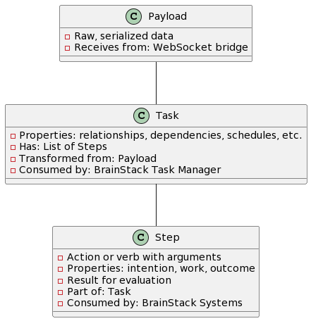

Certainly, to properly conceptualize the data flow in your architecture, we should define the data types and their transformations at each stage of the system. Here are the three identified data types and a proposed structure for handling them:

Data Type Definitions:
Payload:

Initial, serialized data streams received from the websocket bridge.
Unstructured or semi-structured information.
Representation: Serialized string or binary data.
Task:

Deserialized and structured form of Payload.
Has properties such as relationships, dependencies, schedules, prerequisites, and priorities.
Contains a list of Steps.
Representation: Object with properties and an array of Steps.
Step:

The atomic unit of work to be performed as part of a Task.
Each Step is an action or verb combined with arguments (intention, work, outcome).
Has a result property for evaluation after execution.
Representation: Object with action properties, arguments, and result.
Data Flow Structure:

Explanatory Notes:
The Payload class would be the raw data received and is typically serialized. The system must deserialize it to convert it into a Task.

The Task class represents a unit of work, including its context like schedules and dependencies, and contains a list of Steps.

Each Step acts as the smallest executable part of a Task, with clear intentions and expected results.

Data Transformation Process:
Payload to Task: Upon receipt by the system, the Payload is unserialized by the "Data Transformation" service to formulate a Task object.

Task Processing: The "PrintStack Task Manager" and related engines (Rule Engine, State Engine, etc.) process the Task, deciding how it should be carried out and determining which Steps are needed.

Executing Steps: Each Step is executed according to the Task context with actions performed by appropriate services or agents (AI, Memory Systems, etc.).

Feedback Loop: After Step execution, the result is evaluated and might be fed back into the system for further processing or sent back to the front-end via the "Outgoing Queue."

This structure will offer clarity for each stage of data transformation, help test data flow in a controlled manner, and ensure that each data type has a clear and manageable definition. It also paves the way for testing data flow by allowing you to simulate each stage of processing and prescribe how data should be manipulated or transformed at each step.