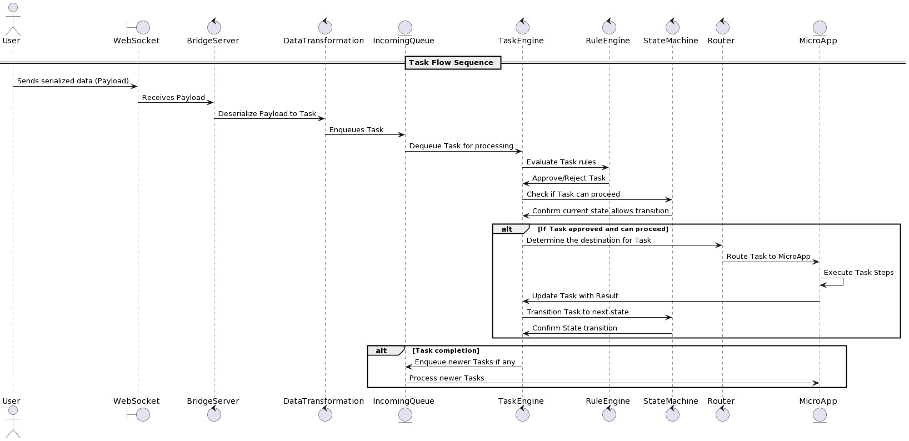

Implementing a task engine and rule engine within your system's architecture should be focused on managing the lifecycle of tasks and ensuring that the business logic is correctly executed based on defined rules and states. Below, I outline a potential strategy for setting these engines up:

Task Engine:
The Task Engine is responsible for managing tasks' execution. It would:

Retrieve a task from the Incoming Queue.
Analyze the task's metadata to understand its requirements and priority.
Manage the Task Lifecycle by:
Scheduling tasks based on the defined schedule and priorities.
Executing steps sequentially or in parallel if there are no dependencies.
Updating Task State to reflect its current status (e.g., pending, in progress, completed, blocked).
Coordinate with other components of the system to perform the necessary work.
Prepare the Next State, based on the outcome of the task's execution.
Rule Engine:
The Rule Engine evaluates tasks and dictates the flow of operations within the system. It would:

Evaluate the applicability of a task based on its predefined properties and context.
Ensure Compliance with business rules and constraints.
Decide upon the feasibility and allow or deny the execution of tasks.
Direct tasks to the appropriate service or micro-app based on the evaluation.
Interaction between the Task and Rule Engines with the Router:
Task Creation:

A Payload comes through the websocket and gets transformed by the Data Transformation service into a Task.
The task is enqueued into the Incoming Queue.
Task Processing:

The Task Engine picks up tasks from the Incoming Queue.
It references the Rule Engine to determine if a task can proceed by evaluating any prerequisites defined in its properties.
Rule Evaluation:

The Rule Engine processes the task, checking against a set of conditional expressions, which can be based on your business logic, and security, data integrity, or other considerations.
It decides the next steps: whether the task is allowed, disallowed, or perhaps modified before proceeding.
Routing Decision:

If a task is cleared by the Rule Engine, the Task Engine then calls on the Router to determine where the task or its subsequent actions should be directed.
The Router could leverage something analogous to a service registry or a configuration mapping to direct the task to the right component based on the task type, content, or context.
Task Execution:

The appropriate destination service or micro-app, as determined by the Router, receives the task and executes it.
After executing the task, the service updates the task status and result, which may be pushed to an Outgoing Queue for reporting, logging, or further actions.
Feedback Loop:

The results of task processing can feedback into the Incoming Queue as new tasks, or they can trigger additional actions that might require further evaluation from the Rule Engine and direction from the Router.
Implementation Example:
Here is a high-level pseudo-code for these engines and their interactions:

class TaskEngine {
    constructor(private ruleEngine: RuleEngine, private router: Router) {}

    processTasks() {
        const task = incomingQueue.fetchTask();
        if (this.ruleEngine.evaluateTask(task)) {
            const destinationComponent = this.router.routeTask(task);
            destinationComponent.execute(task);
        }
    }
    
    // ... other methods and lifecycle management ...
}

class RuleEngine {
    evaluateTask(task) {
        // Business logic determining the validity and constriants for the task
        return task.isValid && this.checkBusinessRules(task);
    }

    // ... other rule evaluation methods ...
}

class Router {
    routeTask(task) {
        // Logic to determine the right component to handle the task
        return this.getServiceForTask(task);
    }
    
    // ... other routing methods ...
}
Keep in mind that this pseudo-code is highly abstracted; it aims to provide a conceptual understanding rather than concrete code. The actual code will likely be more complex, involve async patterns, state checks, exception handling, and integrate with other parts of your system, like event streams or databases.

Creating this setup will require careful planning of your rule definitions, task properties, and router logic. It's recommended to incorporate mechanisms for logging, monitoring, and alerting to maintain visibility over task processing, rule evaluation, and routing within this system. Additionally, consider using existing workflow engines or business rule management systems, which provide robust functionality out-of-the-box.

State Machine:
The State Machine is responsible for managing the state transitions of tasks based on events or outcomes of operations. A state machine often includes states such as pending, processing, completed, failed, etc., and it enforces the rules for transitioning from one state to another.

Interaction with Task and Rule Engines:
Task Processing with State Management:

When the Task Engine retrieves a task, it checks the current state of the task within the State Machine.
Based on the State Machine, the task may be processed, put on hold, or moved to the next state.
Rule Engine with State Awareness:

Before executing or transitioning a task, the Rule Engine checks the task against current business rules, which could include state as part of their conditions.
This allows the system to ensure that only valid transitions occur and that tasks are only processed when they are in an appropriate state.
State Transitions Post-Processing:

Once an action within a task is completed, the State Machine is updated to reflect the new state.
The outcome of the action (success, failure, etc.) may trigger different transitions or state updates.
State-Based Routing:

The Router uses the State Machine to determine where to send or receive tasks, taking the states into account when making routing decisions.
Adding the State Machine to the original pseudo-code example, it would look something like this:

class TaskEngine {
    constructor(private ruleEngine: RuleEngine, private router: Router, private stateMachine: StateMachine) {}

    processTasks() {
        const task = incomingQueue.fetchTask();
        if (this.ruleEngine.evaluateTask(task) && this.stateMachine.canProceed(task)) {
            const destinationComponent = this.router.routeTask(task);
            destinationComponent.execute(task);
            this.stateMachine.transition(task, 'processing');
        }
    }
    
    // ... other methods and lifecycle management ...
}

class StateMachine {
    states = { /* ... task states definition ... */ };

    canProceed(task) {
        // Logic to check if task can proceed based on current state
        return task.state === this.states.pending;
    }
    
    transition(task, newState) {
        // Implement logic to manage state transition
        task.state = newState;
        // ... handle state transition ...
    }
    
    // ... other state management methods ...
}

// The rest of the Rule Engine and Router remains same as before
The State Machine is an integral part of the architecture, imposing structure on the flow of the tasks, managing states responsibly, and preventing any invalid operations that do not align with the task's lifecycle. It works in concert with the Task Engine and Rule Engine to orchestrate complex workflows within the system. Integrating the State Machine in this way ensures that all system components remain consistent with the task's status, which is vital for predictability and reliability.
