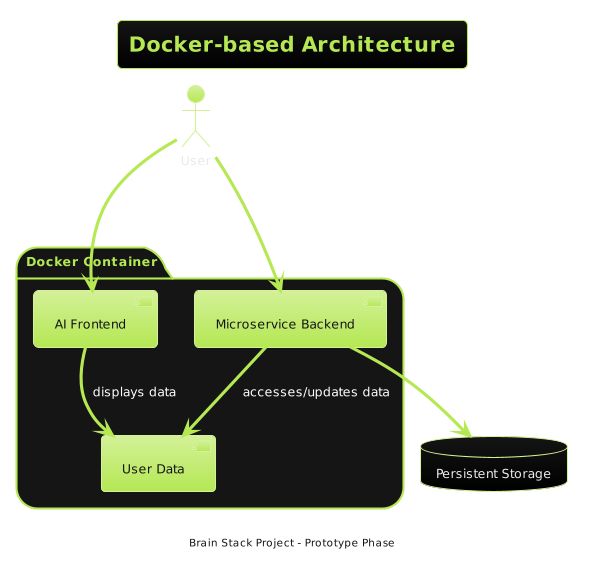
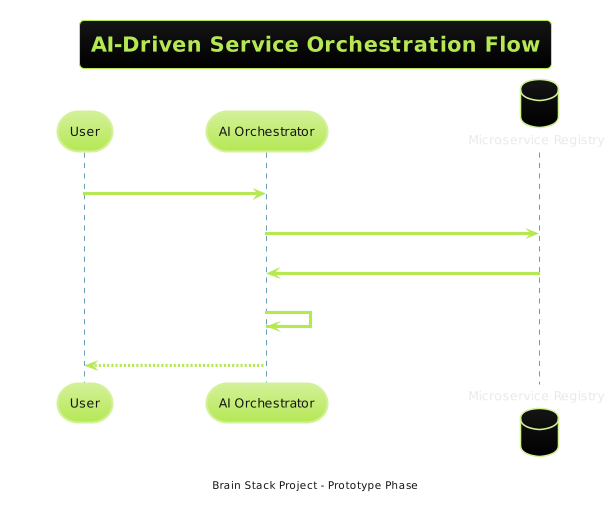
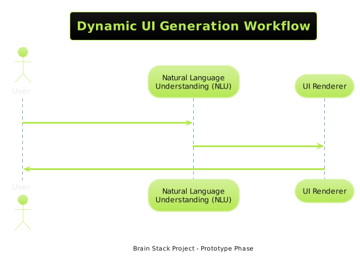
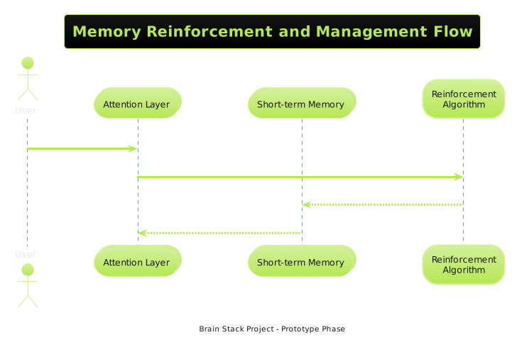

# Brain Stack Project Documentation

## Table of Contents

Detailed Documentation Outline
1. Introduction
- Overview of Brain Stack Project goals
- Explanation of the micro-app and containerized approach
2. Containerization Strategy
- Docker as the core of deployment
- Scaling strategies using container orchestration tools
- Security best practices for containers
3. Service Orchestration
- Orchestration lifecycle: instantiation to decommissioning
- Shared resource management across containers
- Recovery and update strategies
4. Inter-Component Communication
- Data flow between Bridge Server/Client, DTS, Router Service, Task Manager, and Pub/Sub Hub
- PlantUML Sequence Diagram: Component Interaction Flow
5. Personalization in Containerized Instances
- Managing user-specific data and preferences
- Persisting state across sessions with volume mounts

Part 2: Memory Reinforcement and State Management 
1. Memory Management Overview
- Roles of attention, short-term, and long-term memory layers
- PlantUML State Diagram: Memory State Transitions
2. State Synchronization
- Real-time WebSocket state updates
- Event subscription and handling via Pub/Sub Hub
- PlantUML Sequence Diagram: State Sync Workflow
3. Memory Reinforcement Algorithm
-Specification of the reinforcement logic
-Event triggers and system responses
-PlantUML Activity Diagram: Memory Reinforcement Process
4. Short-Term Memory and Attention Transition
- Criteria and process for transitioning memory states
- AI assistant's role in state management
5. Event Definitions and Handlers
- Custom events for memory reinforcement and transition
- Event payloads and their expected effects on the system

---

# 1. Ecosystem Architecture and Containerization

## 1.1. Introduction

The Brain Stack Project is an ambitious endeavor that merges microservices architecture with AI-driven interfaces to create a personalized and responsive user experience. This documentation outlines the current architectural framework and future vision, maintaining transparency about the project's ongoing development and its goals.

---

## 1.2. Containerization Strategy

Embracing a modern approach, Brain Stack employs Docker to facilitate scalable and secure user experiences. While the project aspires to achieve best-in-class standards, the current phase prioritizes foundational development, with advanced security measures planned for future iterations.

---

## 1.3. Service Orchestration

AI plays a critical role in service orchestration within Brain Stack, going beyond traditional protocol to enable intuitive and on-the-fly micro-app management and discovery, driven by cutting-edge natural language understanding technology.

---

## 1.4. Dynamic User Interface Generation

Brain Stack empowers users to create their own UIs, transforming spoken instructions into customized interfaces utilizing NLU. This process is central to the platform's emphasis on real-time personalization and interactivity.

# 2. Memory Management and Reinforcement

## 2.1. Cognitive Computing Core

The memory system in Brain Stack simulates human attention and short-term retention, enabling intelligent data processing and a learning module that adapts dynamically to user behavior for a personalized experience.

...compelete part2...

## Conclusion: The Brain Stack Project

The Brain Stack Project stands at the cusp of software development revolution; it is an endeavor poised to redefine the paradigm of human-computer interaction. As we conclude, let's take a moment to reflect on the journey undertaken and the potential that lies ahead.

### Reflection on Coverage

Throughout this document, we've traversed the lengths of an architectural landscape that is both ambitious and evolving. From the deliberate use of Docker containers to provide isolated, secure, and scalable user experiences to the pioneering efforts in dynamic and on-the-fly user interface generation through Natural Language Understanding, Brain Stack is a prototype that encapsulates both a vision and a series of tangible steps towards its realization.

### The Tangible Benefits

The benefits of such an ecosystem are compelling. Brain Stack promises:

- **Personalization on Demand:** With the power to dictate UI layouts through simple, conversational language, software becomes more accessible, eliminating barriers that often accompany traditional user interfaces.
- **Streamlined Development:** AI-driven orchestration and UI rendering potentially reduce development cycles, allowing for rapid prototyping and deployment of user-centric applications.
- **Progressive Learning:** An intelligent memory management system learns from each interaction, aiming to not only serve but anticipate user needs.

### The Impending Evolution

Now, as we gaze into the potential future shaped by the success of Brain Stack:

- **A New Era of Coding:** The role of developers may shift profoundly, focusing less on routine programming and more on designing sophisticated AI models and crafting user experience strategies.
- **User as the Creator:** Users could have an unprecedented role in the creative process, effectively becoming co-creators of their digital experience.
- **Enhanced Software Interaction:** The line between user and application blurs as software becomes an extension of the user's intent, with the AI translating desires into digital reality.

While optimism fuels our drive, we must tread this pioneering path with measured steps. The Brain Stack Project is, at its heart, a proof of concept—a promise that requires refinement, rigorous testing, and a tenacious pursuit of the objectives set forth.

In the journey ahead, we may indeed reshape the coding landscape, alter how interfaces are generated, and redefine interaction with technology. The Brain Stack Project represents not just a change, but a leap towards a future where software adapts to us, heralding an era where every interaction is as unique as the individual behind the screen.
