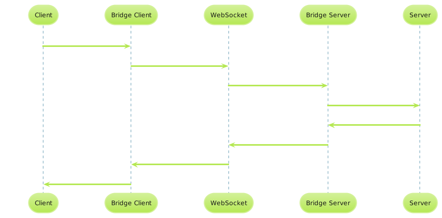
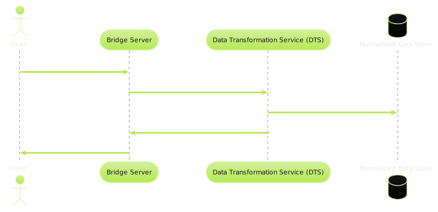
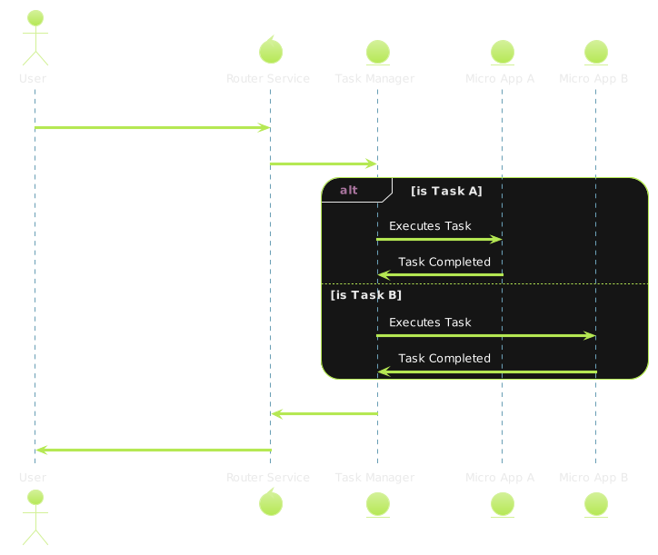
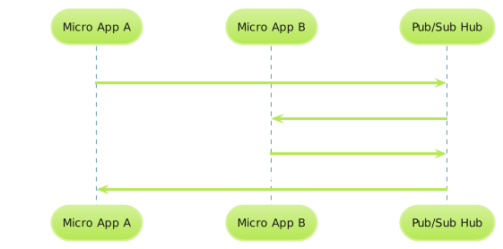
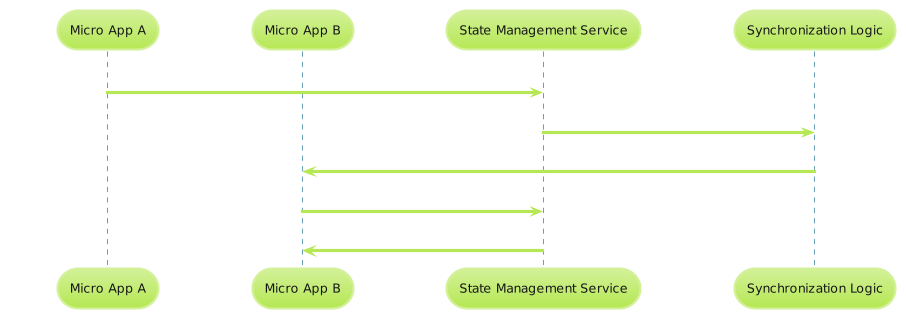

# Brain Stack Project - Architecture Overview

## Table of Contents

1. [Introduction](#introduction)
2. [Bridge Server & Client](#bridge-server--client)
3. [Data Transformation Service (DTS)](#data-transformation-service-dts)
4. [Router Service](#router-service)
5. [Task Manager](#task-manager)
6. [Pub/Sub Hub](#pubsub-hub)
7. [Brain Stack State](#brain-stack-state)
8. [Layer Interaction](#layer-interaction)
9. [Diagrams](#diagrams)
10. [Conclusion](#conclusion)

## Introduction

The Brain Stack Project is visionary in scope, aiming to redefine the landscape of software architecture by integrating microservice back-ends with dynamic, AI-driven front-ends into a cohesive and intuitively responsive system. This architecture summary provides a high-level view of a system engineered for simplicity, elegance, and quantum leaps in user interface interaction, grounded in the principles of atomic-level determinism and seamless user experience design.

## Bridge Server & Client

### Overview

At the foundation of Brain Stack lies the WebSocket communication channel, enabling the real-time transmission of data. The Browser Server and Client are dedicated to seamlessly serializing and deserializing information, ensuring a steady and efficient data flow.

  
*Pub/Sub Hub Event Handling Diagram*

### Functionality

Leveraging the WebSocket protocol, Brain Stack facilitates a bi-directional communication pipeline that provides the underlying transport mechanism for the flux of data between the client and the server components. Central to this layer's responsibility is the efficient serialization of outbound data and deserialization of inbound data to and from the succeeding architectural layers.

## Data Transformation Service (DTS)

### Purpose

Positioned as an intermediary, the Data Transformation Service (DTS) assures the normalization of incoming data, converting various data formats into a coherent and standardized form conducive to further processing and analysis within the Brain Stack ecosystem.

                                                              
*Data Transformation Service Flow Diagram*

### Mechanics

DTS incorporates advanced parsing and transformation algorithms capable of interpreting and restructuring diverse data types. By abstracting the complexity of the raw input, DTS enhances the fidelity and flexibility of Brain Stack's communication layers, providing a critical function that complements the WebSocket layer beneath it.

## Router Service

### Description

The Router Service represents the cognitive nexus of the Brain Stack, designed to intuitively route action-driven payloads to their respective destinations based on both context and content considerations.

  
*Router Service Sequence Diagram*

### Routing Criteria and Logic

This service intelligently distributes tasks through a dynamic routing protocol guided by an event's specific characteristics. It ensures that each action, encapsulated with its unique type and payload, is directed to the appropriate micro app or processing unit within Brain Stack, demonstrating a commitment to smart and efficient decoupled operation.

Rule Engine
## Rule Engine

### Purpose

A rule engine is a fundamental component within the Brain Stack that serves as the arbiter of business logic and decision-making. It is responsible for evaluating conditions and making determinations based on a set of defined business rules.

### Mechanics

The rule engine receives input in the form of data or events, processes this input against the ruleset, and then triggers corresponding actions or workflows. The rules are dynamic, allowing for flexibility and agility in response to complex, real-world scenarios.

### Integration

Embedded seamlessly within the Brain Stack, the rule engine's decisions can dictate the behavior of other components, such as the Router Service or Task Manager. Its integration ensures that Brain Stack acts not only with intelligence but also with principle, adhering to the governance of established rules.
State Machine
## State Machine

### Role

The state machine component of the Brain Stack provides a robust framework for managing the various states that the system can enter. It dictates the flow of operations and transitions based on events, making it an engine of predictable and controllable dynamics.

### Functionality

With preset states and transitions, the state machine meticulously tracks the Brain Stack's status at any given moment. By managing state-driven behavior, it ensures that the system reacts consistently to changes and that workflows are handled in an orderly and expected manner.

### Synchronization with Pub/Sub Hub

The state machine works in harmony with the Pub/Sub Hub to ensure each micro-app is not only aware of state changes but can also respond to them in real-time. This synergy allows for a responsive architecture that adapts fluidly to changing operational contexts, providing a seamless user experience.
With these n

## Task Manager

### Role

The Task Manager orchestrates the systematic execution and management of operations relayed through Brain Stack. It standardizes incoming requests into tasks, delineating a comprehensive task architecture.

### Execution and Scheduling

With functional governance over task scheduling, queuing, and execution strategies, the Task Manager plays an instrumental role in Brain Stack's operational integrity. It provides a structured environment for task prioritization, execution, error handling, and automated retries, embodying the resilience and reliability of the overall architecture.

## Pub/Sub Hub

### The Pub/Sub Pattern

A central orchestrator for event-driven operations, the Pub/Sub Hub, establishes a broadcast channel for the publication and subscription of events. Its significance is attributed to a decoupling technique that promotes modular and detached interactions across Brain Stack assets without frontend/backend boundaries.

  
*Pub/Sub Hub Event Handling Diagram*

### Event Handling and State Synchronization

The Hub maintains a vigilant watch over changes in state and propagates updates across the architectural landscape. By tightly coupling state changes with event notifications, Brain Stack preserves a coherent and synchronized state representation at all times, ensuring that the system response to state mutations is both immediate and accurate.

## Brain Stack State

### Minimalist State Management

In the pursuit of maximal simplicity, the state within Brain Stack is managed on a per-micro-app basis, ensuring that each constituent component retains autonomy over its state while contributing to the larger unified state.

  
*Brain Stack State Synchronization Diagram*

### Synchronization Mechanisms

Introducing a new paradigm of Inter Process Communication, the Inter 
State Communication. The integration of state management with the Pub/Sub Hub allows for a reactive architecture where state changes are simultaneously atomic and systemic, reflecting the system's health and status accurately and perpetuating a cycle of observation, mutation, and resultant action.

## Layer Interaction

### Overview of Inter-Layer Communication

The individual layers of Brain Stack are interwoven through a meticulous design that allows each to function independently while supporting unobstructed communication pathways. Changes in state cascade through the layers with precision, invoking actions and prompting updates that ripple through the architecture.

### Data and Control Flow

The communication protocol embedded within Brain Stack elegantly facilitates the data flow through each layer, adhering to an overarching command structure that maximizes both coherence and modularity.

## Diagrams

The visual representation of Brain Stack's intricacies will manifest in a series of diagrams that capture the nuances and relations of its components. These will provide a vivid portrait of the structure, elevating the comprehension of the inner workings to new heights.

[PLACEHOLDER Overview Diagram]

## Conclusion

The architectural roadmap laid out in this summary defines the trajectory for the continued evolution of the Brain Stack Project. With a foundation inspired by the natural world, aligned with software development's most advanced paradigms, Brain Stack stands poised to revolutionize the digital realm by creating seamless interactions between users and technology.
This comprehensive outline aims to encapsulate the depth of your concept and can be further fleshed out with additional