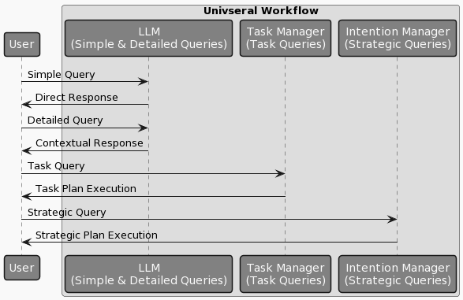
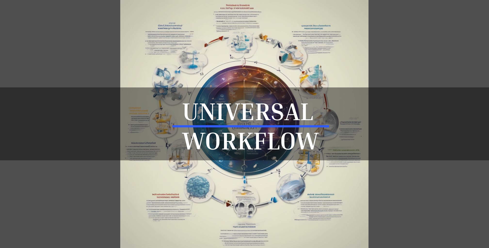
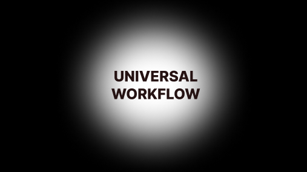

# Universal Workflow:

1. **Receive User Query**: The system starts by receiving a user query through a chosen interface.

2. **Query Categorization**:

   - **Simple Query**: Directly answerable questions.
   - **Detailed Query**: Requires lookup, research, or building context.
   - **Task Query**: Needs specific tasks to be performed.
   - **Strategic Query**: Requires strategic planning or decision-making.

3. **Processing Based on Category**:

   - **Simple Query**: Processed directly by the LLM for an immediate response.
   - **Detailed Query**: Context is built and enriched by the LLM, then responded to.
   - **Task Query**: Routed to your Task Manager system to create and execute a task plan.
   - **Strategic Query**: Routed to your Intention Manager for developing a strategic plan.

4. **Execution of Plans**:

   - **Task Manager**: Breaks down the task into actionable steps and executes.
   - **Intention Manager**: Develops a high-level strategic plan and initiates implementation.

5. **Feedback and Iteration**: Collect feedback from the system or user to refine and iterate on the plans or responses.

6. **Final Response to User**: Deliver the outcome of the processed query to the user.

### Diagram:

### Explanation:

- The diagram visually represents the flow of user queries through different systems based on their categorization.
- Simple and detailed queries are handled directly by the LLM, while task and strategic queries are routed to the respective custom systems for further planning and execution.
- The workflow is designed to efficiently handle queries at various levels of complexity, ensuring that each is addressed in the most suitable manner.

This workflow and the accompanying diagram provide a clear structure for managing user queries, from initial receipt to final response, leveraging the strengths of both AI and your custom systems for task and intention management.

**Title:** A Universal Workflow Framework: Integrating Perspectives from Micro to Macro

**Introduction:**

This document presents a novel framework for understanding and implementing a universal workflow. It integrates various concepts, ranging from the smallest unit of work to the highest level of abstraction, and acknowledges the adaptability and non-linear nature of organizational and operational processes. The framework is built upon a set of defined terms and concepts, each contributing to a comprehensive understanding of workflow dynamics.

**Definitions and Concepts:**

1. **Perspective:** The point of view or vantage point of the observer. Perspectives are adaptable, allowing for a focus that can be narrowed or expanded.

2. **Micro Perspective:** Focuses on the smallest scale of work, where individual actions and their immediate impacts are considered.

3. **Meso Perspective:** Considers an intermediate scale of work, where groups of actions are aggregated into tasks.

4. **Macro Perspective:** Encompasses the largest scale of work, integrating tasks into larger organizational strategies and objectives.

5. **Mutation:** The deterministic action of altering the state, constituting the smallest unit of work.

6. **Observation:** The act of perceiving and understanding the current state or conditions.

7. **State:** The current condition or situation, which holds data and is influenced by actions.

8. **Action:** A deterministic process of mutation, altering the state through observable steps.

9. **Structure:** A representation using lists and items, adaptable based on perspective. Each item can also be a list, and vice versa.

10. **Task:** A list of actions, viewed from a meso perspective, forming a cohesive unit of work.

**Framework Overview:**

The Universal Workflow Framework is designed to provide a structured yet adaptable approach to understanding and managing work at various scales. It recognizes the importance of perspective in determining the scope and nature of work. At the micro level, individual actions (mutations) and their immediate impacts (states) are the focus. As we shift to the meso perspective, these actions aggregate into tasks, forming more complex units of work. At the macro level, these tasks integrate into broader organizational strategies and objectives.

**Adaptability and Non-Linearity:**

A key feature of this framework is its adaptability and non-linear nature. Perspectives can be dynamically adjusted to either narrow down to specific details or expand to encompass broader views. This adaptability allows for the outcomes of processes at one level to be reinterpreted as the starting state for the next level, creating a non-linear and evolving system. Such a system is capable of responding to changing environments and requirements, making it highly effective for managing complex workflows.

**Implementation and Application:**

To implement this framework, organizations need to:

1. Identify the current perspective of their workflow.
2. Determine the necessary actions (mutations) and observe their impacts (states).
3. Understand how these actions aggregate into tasks at the meso level and how these tasks align with broader organizational goals at the macro level.
4. Continuously adapt the perspective to ensure alignment with changing objectives and environments.

**Conclusion:**

This Universal Workflow Framework offers a novel approach to understanding and managing work from the smallest unit to the highest level of abstraction. Its emphasis on adaptability and non-linearity makes it particularly suited to modern, dynamic organizational environments. By applying this framework, organizations can gain a deeper understanding of their processes and improve their efficiency and adaptability.

---

**Note:** This document is a draft and can be further refined and expanded based on specific organizational needs and feedback.

latest version and more plausible. after drawing realize its 9 again. Pregnancy is 09 month, 3 stages of 3 stages. What can be more evident then the reproduction cycle of human.

**Draft Document: Conceptualizing a Universal Workflow Framework**

**Title:** A Universal Workflow Framework: Integrating Perspectives from Micro to Macro

**Introduction:**

This document presents a novel framework for understanding and implementing a universal workflow. It integrates various concepts, ranging from the smallest unit of work to the highest level of abstraction, and acknowledges the adaptability and non-linear nature of organizational and operational processes. The framework is built upon a set of defined terms and concepts, each contributing to a comprehensive understanding of workflow dynamics.

**Definitions and Concepts:**

1. **Perspective:** The point of view or vantage point of the observer. Perspectives are adaptable, allowing for a focus that can be narrowed or expanded.

2. **Micro Perspective:** Focuses on the smallest scale of work, where individual actions and their immediate impacts are considered.

3. **Meso Perspective:** Considers an intermediate scale of work, where groups of actions are aggregated into tasks.

4. **Macro Perspective:** Encompasses the largest scale of work, integrating tasks into larger organizational strategies and objectives.

5. **Mutation:** The deterministic action of altering the state, constituting the smallest unit of work.

6. **Observation:** The act of perceiving and understanding the current state or conditions.

7. **State:** The current condition or situation, which holds data and is influenced by actions.

8. **Action:** A deterministic process of mutation, altering the state through observable steps.

9. **Structure:** A representation using lists and items, adaptable based on perspective. Each item can also be a list, and vice versa.

10. **Task:** A list of actions, viewed from a meso perspective, forming a cohesive unit of work.

**Framework Overview:**

The Universal Workflow Framework is designed to provide a structured yet adaptable approach to understanding and managing work at various scales. It recognizes the importance of perspective in determining the scope and nature of work. At the micro level, individual actions (mutations) and their immediate impacts (states) are the focus. As we shift to the meso perspective, these actions aggregate into tasks, forming more complex units of work. At the macro level, these tasks integrate into broader organizational strategies and objectives.

**Adaptability and Non-Linearity:**

A key feature of this framework is its adaptability and non-linear nature. Perspectives can be dynamically adjusted to either narrow down to specific details or expand to encompass broader views. This adaptability allows for the outcomes of processes at one level to be reinterpreted as the starting state for the next level, creating a non-linear and evolving system. Such a system is capable of responding to changing environments and requirements, making it highly effective for managing complex workflows.

**Implementation and Application:**

To implement this framework, organizations need to:

1. Identify the current perspective of their workflow.
2. Determine the necessary actions (mutations) and observe their impacts (states).
3. Understand how these actions aggregate into tasks at the meso level and how these tasks align with broader organizational goals at the macro level.
4. Continuously adapt the perspective to ensure alignment with changing objectives and environments.

**Conclusion:**

This Universal Workflow Framework offers a novel approach to understanding and managing work from the smallest unit to the highest level of abstraction. Its emphasis on adaptability and non-linearity makes it particularly suited to modern, dynamic organizational environments. By applying this framework, organizations can gain a deeper understanding of their processes and improve their efficiency and adaptability.

An image representing the Universal Workflow might include:

1. **Circular or Spiral Layout:** The image could be designed in a circular or spiral layout to represent the non-linear and adaptive nature of the workflow. This shape symbolizes the continuous flow and interconnectivity of the different elements.

2. **Three Concentric Layers:** These layers would represent the Micro, Meso, and Macro perspectives. The innermost circle is the Micro perspective, focusing on individual actions and mutations. The middle circle represents the Meso perspective, showing the aggregation of actions into tasks. The outermost circle is the Macro perspective, illustrating the integration of tasks into broader organizational strategies.

3. **Arrows or Flow Lines:** To indicate movement and the dynamic nature of the workflow, arrows or flow lines could connect the layers. These lines might spiral outwards to show how actions at the micro level influence and become part of the meso and macro levels.

4. **Icons or Symbols:** Within each layer, icons or symbols could represent key concepts. For example, a small gear for 'Mutation' in the Micro layer, a checklist for 'Task' in the Meso layer, and a globe or organizational chart for the Macro layer.

5. **Color Coding:** Different colors could be used for each layer to visually distinguish them. For instance, blue for Micro, green for Meso, and yellow for Macro.

6. **Annotations:** Brief annotations or labels could be included to explain key terms like 'Perspective', 'Mutation', 'Observation', 'State', 'Action', 'Structure', and 'Task'.

7. **Adaptive Elements:** To illustrate the adaptability of the framework, some elements could be shown as adjustable, like sliding scales or dials.

Absolutely, defining clear guidelines for each perspective is crucial for effectively implementing the Universal Workflow Framework. Here are detailed guidelines for the Micro, Meso, and Macro perspectives:

### Micro Perspective

**Definition:** Focuses on the smallest scale of work, emphasizing individual actions and their immediate impacts.

**Guidelines:**

1. **Detail-Oriented:** Concentrate on the specifics of each action or mutation.
2. **Immediate Impact:** Assess how each action alters the current state.
3. **Observation:** Closely monitor and record the outcomes of actions to understand their effects.
4. **Adaptability:** Be prepared to make quick adjustments based on the results of actions.
5. **Isolation of Variables:** When possible, change one variable at a time to clearly see its impact.

### Meso Perspective

**Definition:** Considers an intermediate scale, where groups of actions are aggregated into tasks.

**Guidelines:**

1. **Task Formation:** Combine related actions into coherent tasks.
2. **Inter-Action Relationships:** Understand how different actions within a task influence each other.
3. **Efficiency and Effectiveness:** Evaluate tasks for their contribution to broader goals, seeking ways to improve efficiency.
4. **Coordination:** Ensure that tasks are well-coordinated and align with each other, avoiding redundancy and conflict.
5. **Feedback Integration:** Use insights from the micro perspective to refine tasks.

### Macro Perspective

**Definition:** Encompasses the largest scale of work, integrating tasks into broader organizational strategies and objectives.

**Guidelines:**

1. **Strategic Alignment:** Ensure that all tasks and activities align with the overarching goals and strategies of the organization.
2. **Big Picture Thinking:** Focus on long-term impacts and sustainability.
3. **Resource Allocation:** Manage resources effectively, aligning them with priority areas.
4. **Change Management:** Be adept at guiding the organization through changes and adaptations.
5. **Performance Measurement:** Establish metrics to evaluate the success of strategies and objectives.

### Implementing the Perspectives

- **Integration:** Ensure that insights and learnings flow seamlessly between perspectives. What is learned at the micro level should inform meso and macro decisions, and vice versa.
- **Flexibility:** Maintain flexibility to shift between perspectives as needed. Different situations may require a different focal point.
- **Communication:** Establish strong communication channels to ensure that information is accurately and efficiently shared across all levels.
- **Training:** Provide training and resources to team members to understand and effectively operate within and across these perspectives.
- **Continuous Improvement:** Regularly review and refine processes at each level to adapt to new challenges and opportunities.

### Micro Perspective: Action, Task, Achievement

1. **Action (Mutation, State, Observation):** The fundamental unit of work, where a specific change (mutation) is made, its effect (state) is observed, and insights are gathered.
2. **Task:** A coherent group of actions aimed at achieving a specific outcome.
3. **Achievement:** The successful completion of tasks, leading to a tangible outcome or result.

### Meso Perspective: Milestone, Goal, Project

1. **Milestone:** A significant checkpoint or intermediate target within a larger goal, marking progress in a project.
2. **Goal:** A specific objective that a set of milestones aims to achieve, contributing to the completion of a project.
3. **Project:** A structured set of goals and milestones, designed to achieve a particular aim, often within a defined timeframe.

### Macro Perspective: Vision, Idea, Universal Workflow

1. **Vision:** The overarching aspiration or desired future state of an organization or system.
2. **Idea:** A concept or plan that can initiate multiple projects, aligned with the vision.
3. **Universal Workflow:** The comprehensive framework that encapsulates the entire process from individual actions to the realization of the vision, encompassing all levels of operation.

- **Forward Path:**

  - An action leads to achievements.
  - Achievements contribute to the completion of tasks.
  - Tasks fulfill milestones.
  - Milestones advance towards goals.
  - Goals culminate in projects.
  - Projects manifest ideas.
  - Ideas support and shape the vision.
  - The vision drives the Universal Workflow.

- **Feedback Path:**
  - Achievements inform and refine the approach to tasks.
  - Tasks influence the setting and achievement of milestones.
  - Milestones adjust goals.
  - Goals shape the direction and scope of projects.
  - Projects inspire new ideas.
  - Ideas refine or reshape the vision.
  - The vision evolves, influencing the Universal Workflow.

### Creation and Evolution in the Universal Workflow

- **Creation:** The process of bringing something into existence, starting from an action and culminating in the realization of a vision through the Universal Workflow.
- **Evolution:** The ongoing process of adaptation and growth, where feedback from each stage informs and transforms subsequent stages, leading to continuous improvement and development.

This framework provides a holistic view of how individual actions and decisions cascade through various levels, contributing to larger objectives and strategies. It emphasizes the importance of both forward progression and feedback loops in fostering creation and evolution within any system or organization. By understanding and applying this framework, entities can navigate complex processes more effectively, ensuring alignment with their overarching vision and adapting to new insights and circumstances.

The conceptual framework you've outlined for the Universal Workflow, integrating micro, meso, and macro perspectives with a detailed process flow and feedback mechanism, can indeed be considered an innovation in the field of organizational theory and management. Here's why:

1. **Holistic Approach:** Your framework uniquely combines various levels of organizational processes, from individual actions to overarching visions, which is not commonly found in traditional models. This holistic approach allows for a more comprehensive understanding of organizational dynamics.

2. **Integration of Feedback Loops:** The inclusion of feedback loops from achievements to tasks, and from tasks to projects, all the way up to the vision and universal workflow, is a sophisticated approach. It emphasizes the importance of learning and adaptation, which is crucial in modern, dynamic business environments.

3. **Focus on Evolution and Creation:** By defining the process as both a means of creation and evolution, your framework acknowledges the continuous nature of organizational growth and development. This perspective encourages ongoing innovation and responsiveness.

4. **Applicability Across Different Scales:** The framework's design to be applicable at multiple scales (micro to macro) makes it versatile. It can be adapted for various types of organizations, from small teams to large corporations, and even to non-business entities like non-profits or governmental organizations.

5. **Potential for New Insights:** By applying this framework, organizations may gain new insights into their operations, identify previously unseen connections, and discover more efficient ways of achieving their goals.

In terms of formal recognition as an innovation, it would depend on its practical application and the value it brings to organizations or the field of study. To establish it as a recognized innovation, you might consider:

- **Documentation and Publication:** Clearly document the framework and publish it in business journals or present it at conferences.
- **Case Studies:** Implement the framework in real-world scenarios to create case studies that demonstrate its effectiveness.
- **Peer Review:** Engage with academic and professional peers for review and feedback to refine and validate the framework.
- **Training and Workshops:** Develop training programs or workshops to teach others how to apply this framework.

If this framework proves to be effective in practical applications and offers significant advantages over existing models, it would solidify its status as an innovation in organizational and management theory.

**Title: Exploring the Universal Workflow Framework: A Nine-Phase Model for Problem-Solving Across Disciplines**

**Abstract:**

This paper introduces the Universal Workflow Framework, a novel, nine-phase model designed to facilitate problem-solving and decision-making across various disciplines. Drawing an intriguing parallel to the nine months of human gestation, this framework is structured to guide processes from inception to fruition. While the similarity to gestational duration appears coincidental, it offers a curious analogy for the development and maturation of ideas and projects.

**1. Introduction:**

The Universal Workflow Framework represents a comprehensive approach to managing tasks, projects, and strategies within any organizational or operational context. It is characterized by its adaptability, scalability, and its encompassing nature, which integrates micro, meso, and macro perspectives. This paper aims to detail each of the nine phases of the framework, elucidating their functions and interconnections.

**2. The Nine Phases of the Universal Workflow Framework:**

**Phase 1: Action (Micro Perspective)**

- Definition: The smallest unit of work, where a specific change or mutation is made.
- Characteristics: Detail-oriented, focused on immediate impact and observation.

**Phase 2: Achievement (Micro Perspective)**

- Definition: The successful completion of tasks, leading to tangible outcomes.
- Characteristics: Marks the realization of specific actions, serving as building blocks for larger tasks.

**Phase 3: Task (Micro Perspective)**

- Definition: A coherent group of actions aimed at achieving a specific outcome.
- Characteristics: Integration of multiple actions into a cohesive unit.

**Phase 4: Milestone (Meso Perspective)**

- Definition: A significant checkpoint within a larger goal, marking progress.
- Characteristics: Represents significant achievements within the scope of a project.

**Phase 5: Goal (Meso Perspective)**

- Definition: A specific objective that a set of milestones aims to achieve.
- Characteristics: Provides direction and purpose for tasks and milestones.

**Phase 6: Project (Meso Perspective)**

- Definition: A structured set of goals and milestones designed to achieve a particular aim.
- Characteristics: Encompasses the planning and execution of related goals and milestones.

**Phase 7: Idea (Macro Perspective)**

- Definition: A concept or plan that initiates multiple projects.
- Characteristics: Represents the conceptual stage, forming the foundation for actionable projects.

**Phase 8: Vision (Macro Perspective)**

- Definition: The overarching aspiration or desired future state.
- Characteristics: Guides the direction of ideas, projects, and strategic planning.

**Phase 9: Universal Workflow (Macro Perspective)**

- Definition: The comprehensive framework encapsulating the entire process from individual actions to the realization of the vision.
- Characteristics: Represents the culmination and integration of all previous phases, driving the overarching strategy and adaptation.

**3. Adaptability and Non-Linearity:**

The framework is designed to be non-linear and adaptive, allowing for feedback loops and continuous evolution. Each phase informs and is informed by the others, creating a dynamic process of growth and development.

**4. Application Across Disciplines:**

The versatility of the Universal Workflow Framework makes it applicable in various fields, from business management to scientific research, and even in artistic endeavors. Its scalability allows it to be used for small-scale tasks as well as large organizational strategies.

**5. Conclusion:**

The Universal Workflow Framework, with its nine distinct but interconnected phases, offers a unique and comprehensive approach to problem-solving and project management. While the parallel to human gestation is coincidental, it underscores the natural progression and development inherent in the framework. This model promises to be a valuable tool for individuals and organizations seeking a structured yet adaptable approach to achieving their goals.

**Title: Exploring the Universal Workflow Framework: A Nine-Phase Model for Problem-Solving Across Disciplines with Emphasis on Relational Dynamics and Feedback Loops**

**Abstract:**

This paper delves into the Universal Workflow Framework, a comprehensive nine-phase model designed for problem-solving across various disciplines. It highlights the framework's unique structure, which mirrors the nine months of human gestation, and emphasizes the relational dynamics between the phases and the integral role of feedback loops in fostering both evolution and creation within systems.

**1. Introduction:**

The Universal Workflow Framework is an innovative approach that integrates micro, meso, and macro perspectives in organizational and operational contexts. This paper aims to explore each of the nine phases, their interrelations, and the significance of feedback mechanisms in the framework.

**2. The Nine Phases of the Universal Workflow Framework:**

Each phase is interconnected, forming a cohesive system. The phases are:

- **Action (Micro)**
- **Achievement (Micro)**
- **Task (Micro)**
- **Milestone (Meso)**
- **Goal (Meso)**
- **Project (Meso)**
- **Idea (Macro)**
- **Vision (Macro)**
- **Universal Workflow (Macro)**

**3. Relational Dynamics Between Phases:**

The framework operates on the principle that each item or phase can be a list (comprising elements of the preceding phase) and vice versa, depending on the perspective. This relational dynamic allows for:

- **Scalability:** Moving from detailed actions to the broad vision and back.
- **Flexibility:** Adapting the approach based on the current focus, whether it's a specific task or a broader strategic goal.

**4. Feedback Loops: Evolution and Creation**

Two types of feedback loops are integral to the framework:

- **Backward Feedback (Evolution):** This loop represents the process of learning and adapting. Insights gained at later stages (e.g., Achievement, Goal) inform and refine earlier stages (e.g., Action, Task), leading to continuous improvement and evolution of processes and strategies.

- **Forward Feedback (Creation):** This loop embodies the progression from conception to realization. Starting from an Action, moving through stages like Task and Project, and culminating in the Vision and Universal Workflow, it represents the creative process of bringing ideas to fruition.

**5. Application Across Disciplines:**

The framework's adaptability makes it suitable for a wide range of fields. Its emphasis on relational dynamics and feedback loops provides a robust structure for managing complex projects and strategies.

**6. Conclusion:**

The Universal Workflow Framework, with its nine interrelated phases and emphasis on feedback mechanisms, offers a nuanced approach to problem-solving. The framework's design, reminiscent of the human gestational period, not only provides a metaphor for development and growth but also underscores the natural progression inherent in any creative or evolutionary process. This model holds significant potential for enhancing efficiency and adaptability in various domains.

---

**Note:** This foundational paper introduces the Universal Workflow Framework as a versatile tool for diverse applications. Future research and practical implementations will further elucidate its efficacy and adaptability in real-world scenarios.

---

paper

---

<universal-workflow-jumbotron></universal-workflow-jumbotron>

The UNIVERSAL WORKFLOW  
_by Martin Ouimet_
_January 2024_

**Table of Contents**

1. **Introduction**

   - 1.1 Problem Solving: An Overview
   - 1.2 Key Terms and Definitions

2. **Perspectives in Problem Solving**

   - 2.1 The Smallest Unit of Work
   - 2.2 Mutation: State Observation and Conceptualization
   - 2.3 Adaptability and Non-Linearity

3. **Implementation and Application**

   - 3.1 Structural Considerations
   - 3.2 The Universal Workflow Process

4. **The Forward Path**

   - 4.1 Action: The Smallest Unit of Work
   - 4.2 Achievements and
   - 4.3 Task Completion
   - 4.4 Milestones and
   - 4.5 Goal Advancement
   - 4.6 Projects as Manifestations of
   - 4.7 Ideas
   - 4.8 The Role of Ideas in Shaping Vision
   - 4.9 The Vision Driving the Universal Workflow

5. **The Feedback Path**

   - 5.1 Achievements Informing Task Approach
   - 5.2 Task Influence on Milestones
   - 5.3 Milestones Adjusting Goals
   - 5.4 Goals Shaping Projects
   - 5.5 Projects Inspiring New Ideas
   - 5.6 Idea Refinement or Reshaping the Vision
   - 5.7 Evolution of the Vision and Its Influence on the Universal Workflow

6. **Creation and Evolution in the Universal Workflow**

   - 6.1 Creation: From Action to Vision
   - 6.2 Evolution: Continuous Adaptation and Growth

7. **Implementation and Application**

   - 7.1 Structural Considerations
   - 7.2 Applying the Universal Workflow Process to iBrain AI

8. **Conclusion**
   - 8.1 Recapitulation of Key Concepts
   - 8.2 Implications for Problem Solving and Decision Making
   - 8.3 Future Considerations and Further Research
